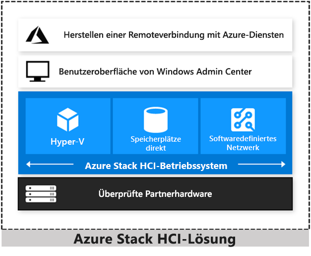

# Übersicht über Azure Stack HCI-Lösungen

Azure Stack HCI ist ein hyperkonvergenter Windows Server 2019-Cluster, für den validierte Hardware zum lokalen Ausführen virtualisierter Workloads verwendet wird. Sie können optional auch eine Verbindung mit Azure-Diensten für cloudbasierte Sicherungen, Sitewiederherstellung und andere Zwecke herstellen. Für Azure Stack HCI-Lösungen wird von Microsoft validierte Hardware verwendet, um eine optimale Leistung und Zuverlässigkeit zu gewährleisten. Die Lösungen beinhalten Unterstützung für Technologien wie NVMe-Laufwerke, persistenten Speicher und RDMA-Netzwerke (Remote-Direct Memory Access, Remotezugriff auf den direkten Speicher).

Azure Stack HCI ist eine Lösung, in der mehrere Produkte kombiniert sind:

- Hardware von einem OEM-Partner
- Windows Server 2019 Datacenter Edition
- Windows Admin Center
- Azure-Dienste (optional)

Azure Stack HCI ist eine hyperkonvergente Lösung von Microsoft, die bei vielen Hardwarepartnern erhältlich ist. Erwägen Sie die folgenden Szenarien für eine hyperkonvergente Lösung, damit Sie ermitteln können, ob Azure Stack HCI die beste Lösung für Ihre Anforderungen ist:

- **Aktualisieren veralteter Hardware**: Ersetzen Sie ältere Server und Speicherinfrastrukturen, und führen Sie virtuelle Windows- und Linux-Computer lokal und im Edgebereich mit vorhandenen IT-Fähigkeiten und Tools aus.

- **Zusammenfassen virtualisierter Workloads**: Fassen Sie ältere Apps in einer effizienten hyperkonvergenten Infrastruktur zusammen. Nutzen Sie die gleichen effizienten Cloudoptionen, die zum Ausführen von Datencentern mit Hyperskalierung, z. B. Microsoft Azure, verwendet werden.

- **Herstellen einer Verbindung mit Azure für Hybrid Cloud-Dienste**: Optimieren Sie den Zugriff auf Cloudverwaltungs- und Sicherheitsdienste in Azure, z. B. externe Sicherung, Sitewiederherstellung, cloudbasierte Überwachung und mehr.

## Azure Stack-Familie

Azure Stack HCI ist Teil der Azure- und Azure Stack-Familie, und es wird die gleiche softwaredefinierte Compute-, Speicher- und Netzwerksoftware verwendet wie für Azure Stack Hub. Weiter unten finden Sie eine kurze Übersicht über die unterschiedlichen Lösungen. Weitere Informationen finden Sie unter [Unterschiede zwischen der globalen Azure-Infrastruktur, Azure Stack Hub und Azure Stack HCI](../operator/compare-azure-azure-stack.md).

- [Azure:](https://azure.microsoft.com) Nutzen Sie öffentliche Clouddienste für bedarfsorientierte Self-Service-Computeressourcen, um vorhandene Apps zu migrieren und zu modernisieren und neue cloudnative Apps zu entwickeln.
- [Azure Stack Edge](https://docs.microsoft.com/azure/databox-online/data-box-edge-overview): Beschleunigen Sie Workloads für maschinelles Lernen, und führen Sie lokale Containeranwendungen oder virtualisierte Workloads auf einem in der Cloud verwalteten Gerät aus.
- [Azure Stack HCI](https://azure.microsoft.com/overview/azure-stack/hci): Führen Sie virtualisierte Anwendungen aus, ersetzen und konsolidieren Sie veraltete Serverinfrastruktur, und stellen Sie für Clouddienste eine Verbindung mit Azure her.
- [Azure Stack Hub](../operator/azure-stack-overview.md): Führen Sie mithilfe einheitlicher Azure-Dienste Cloudanwendungen lokal aus, entweder nach dem Trennen der Verbindung oder zum Erfüllen rechtlicher Anforderungen.

Weitere Informationen:

- Informieren Sie sich auf unserer Website mit den Lösungen für [Azure Stack HCI](https://azure.microsoft.com/overview/azure-stack/hci).
- Sehen Sie sich das Video mit den Microsoft-Experten Jeff Woolsey und Vijay Tewari an, in dem diese über die [neuen Azure Stack HCI-Lösungen](https://aka.ms/AzureStackOverviewVideo) sprechen.

## Effizienz durch Hyperkonvergenz

In Azure Stack HCI-Lösungen sind stark virtualisierte Compute-, Speicher- und Netzwerkeinheiten auf branchenüblichen x86-Servern und -Komponenten vereint. Das Kombinieren von Ressourcen in demselben Cluster erleichtert Ihnen die Bereitstellung, Verwaltung und Skalierung. Führen Sie die Verwaltung über eine Befehlszeilenautomatisierung Ihrer Wahl oder mit Windows Admin Center durch.

Erzielen Sie branchenführende VM-Leistung für Ihre Server-Apps mit Hyper-V, der grundlegenden Hypervisor-Technologie der Microsoft-Cloud, und der Technologie „Direkte Speicherplätze“ mit integrierter Unterstützung für NVMe, persistenten Speicher und RDMA-Netzwerke (Remote-Direct Memory Access, Remotezugriff auf den direkten Speicher).

Sorgen Sie für den Schutz von Apps und Daten, indem Sie abgeschirmte virtuelle Computer, Mikrosegmentierung von Netzwerken und native Verschlüsselung nutzen.

## Hybridfunktionen

Sie können die Vorteile der Zusammenarbeit der Cloud und der lokalen Umgebung nutzen, indem Sie eine hyperkonvergente Infrastrukturplattform in der öffentlichen Cloud verwenden. Ihr Team kann mit dem Aufbauen von Cloudfähigkeiten mit integrierter Integration in Azure-Infrastruktur-Verwaltungsdienste beginnen:

- Azure Site Recovery für Hochverfügbarkeit und Notfallwiederherstellung als Dienst (Disaster-Recovery-as-a-Service, DRaaS)
- Azure Monitor, ein zentraler Hub, in dem Sie die Aktivität Ihrer Apps, Netzwerke und Infrastrukturen überwachen können – mithilfe erweiterter KI-Analysen
- Cloud Witness, um Azure als einfache Entscheidungshilfe für ein Clusterquorum zu verwenden
- Azure Backup für Offsitedatenschutz und den Schutz vor Ransomware
- Azure-Updateverwaltung für die Bewertung und Bereitstellung von Updates für Windows-VMs, die in Azure und lokal ausgeführt werden
- Azure-Netzwerkadapter zum Verbinden lokaler Ressourcen mit Ihren VMs in Azure über ein Point-to-Site-VPN
- Synchronisieren Sie Ihren Dateiserver mit der Cloud, indem Sie die Azure-Dateisynchronisierung verwenden.

Weitere Informationen finden Sie unter [Verbinden von Windows Server mit Azure Hybrid-Diensten](https://docs.microsoft.com/windows-server/manage/windows-admin-center/azure/index).

## Verwaltungstools und System Center

Für Azure Stack HCI wird die gleiche Virtualisierung und softwaredefinierte Speicher- und Netzwerksoftware verwendet wie für Azure Stack Hub. Mit Azure Stack HCI verfügen Sie aber über alle Administratorrechte im Cluster und können die entsprechende Technologie direkt verwalten:

- [Hyper-V](https://docs.microsoft.com/windows-server/virtualization/hyper-v/hyper-v-on-windows-server)
- [Direkte Speicherplätze](https://docs.microsoft.com/windows-server/storage/storage-spaces/storage-spaces-direct-overview)
- [Softwaredefiniertes Netzwerk](https://docs.microsoft.com/windows-server/networking/sdn/)
- [Failoverclustering](https://docs.microsoft.com/windows-server/failover-clustering/failover-clustering-overview)

Sie können für die Verwaltung dieser Technologie die folgenden Tools verwenden:

- [Windows Admin Center](https://docs.microsoft.com/windows-server/manage/windows-admin-center/overview)
- [System Center](https://www.microsoft.com/cloud-platform/system-center)
- [PowerShell](https://docs.microsoft.com/powershell/?view=powershell-6)
- Andere Verwaltungstools, z. B. [Server-Manager](https://docs.microsoft.com/windows-server/administration/server-manager/server-manager) und MMC-Snap-Ins
- Tools, die nicht von Microsoft stammen, z. B. 5Nine Manager

Wenn Sie sich für System Center entscheiden, um Ihre Infrastruktur bereitzustellen und zu verwalten, verwenden Sie System Center Virtual Machine Management (VMM) und System Center Operations Manager. Mit VMM führen Sie die Bereitstellung und Verwaltung der Ressourcen durch, die zum Erstellen und Bereitstellen von virtuellen Computern und Diensten in privaten Clouds benötigt werden. Mit Operations Manager überwachen Sie Dienste, Geräte und Vorgänge in Ihrem gesamten Unternehmen, um Probleme zu identifizieren, bei denen sofort Maßnahmen ergriffen werden müssen.

## Hardwarepartner

Sie können validierte Azure Stack HCI-Lösungen, für die Windows Server 2019 ausgeführt wird, bei 20 Partnern erwerben. Ihr bevorzugter Microsoft-Partner führt für Sie die Einrichtung ohne lange Entwurfs- und Builddauern durch. Er dient auch als zentraler Ansprechpartner für die Implementierung und Supportleistungen.

Besuchen Sie unsere [Azure Stack HCI-Website](https://azure.microsoft.com/overview/azure-stack/hci), um sich über die mehr als 70 Azure Stack HCI-Lösungen zu informieren, die diese Microsoft-Partner derzeit im Angebot haben: ASUS, Axellio, Blue Chip, DataON, Dell EMC, Fujitsu, HPE, Hitachi, Huawei, Lenovo, NEC, primeLine Solutions, QCT, SecureGUARD und Supermicro.

## Lernen anhand von Videos

Das Video zum erweiterten Azure-Netzwerk finden Sie unter folgendem Link:

- [Nahtlose Konnektivität mit Azure mit Windows Server und Hybridnetzwerken](https://www.youtube.com/watch?v=do2_4Y2p9dk)

Hier finden Sie einige Videos von den Microsoft Ignite 2019-Sitzungen:

- [Microsoft Ignite Live 2019 – Erste Schritte mit Azure Stack HCI](https://www.youtube.com/watch?v=vueHIBqNIEU)
- [Informationen zu Azure Stack HCI](https://www.youtube.com/watch?v=4aGZK0Ndmh8&list=PLQXpv_NQsPICdXZoH-EzlIFa4P6VS5m11&index=13&t=0s)
- [Modernisieren von Einzelhandelsgeschäften oder Zweigstellen mit Azure Stack HCI](https://www.youtube.com/watch?v=-JzLhjfkhmM&list=PLQXpv_NQsPICdXZoH-EzlIFa4P6VS5m11&index=9&t=0s)
- [Neuerungen in Azure Stack HCI: 45 Dinge in 45 Minuten](https://www.youtube.com/watch?v=C5J4IEnlS_E&list=PLQXpv_NQsPICdXZoH-EzlIFa4P6VS5m11&index=12&t=0s)
- [Schneller Einstieg in die Azure Stack HCI-Bereitstellung](https://www.youtube.com/watch?v=gxaPJLrWy5w&list=PLQXpv_NQsPICdXZoH-EzlIFa4P6VS5m11&index=11&t=0s)
- [Verkleinerung von Daten: Datendeduplizierung in Azure Stack HCI](https://www.youtube.com/watch?v=fmm4iDbDiY4&list=PLQXpv_NQsPICdXZoH-EzlIFa4P6VS5m11&index=23&t=0s)
- [Anmerkungen aus der Praxis zu Azure Stack HCI von Dave Kawula](https://www.youtube.com/watch?v=OXv7fLlz0ew&list=PLQXpv_NQsPICdXZoH-EzlIFa4P6VS5m11&index=2&t=0s)

Video von einer virtuellen Hybrid Cloud-Veranstaltung:

- [Azure Stack HCI | Virtuelle Hybrid Cloud-Veranstaltung](https://www.youtube.com/watch?v=nxpoEva-R2Y)

## Häufig gestellte Fragen

### Welche Gemeinsamkeiten haben Azure Stack Hub- und Azure Stack HCI-Lösungen?

Azure Stack HCI-Lösungen umfassen dieselben Hyper-V-basierten, softwaredefinierten Compute-, Speicher- und Netzwerktechnologien wie Azure Stack Hub. Beide Angebote erfüllen strenge Test- und Validierungsvorgaben, um die Zuverlässigkeit und Kompatibilität mit der zugrunde liegenden Hardwareplattform sicherzustellen.

### Inwiefern unterscheiden sie sich?

Mit Azure Stack Hub führen Sie Clouddienste lokal aus. Sie können IaaS- und -PaaS-Dienste von Azure lokal ausführen, um Cloud-Apps unabhängig vom Standort konsistent erstellen und ausführen zu können. Die Verwaltung wird lokal über das Azure-Portal durchgeführt.

Mit Azure Stack HCI führen Sie virtualisierte Workloads lokal aus, und für die Verwaltung nutzen Sie Windows Admin Center und vertraute Windows Server-Tools. Sie können optional eine Verbindung mit Azure für Hybridszenarien herstellen, z. B. cloudbasierte Sitewiederherstellung, Überwachung und mehr.

### Weshalb fügt Microsoft sein HCI-Angebot der Azure Stack-Familie hinzu?

Die hyperkonvergente Technologie von Microsoft ist bereits die Basis für Azure Stack Hub.

Viele Microsoft-Kunden arbeiten mit komplexen IT-Umgebungen. Unser Ziel ist es, unseren Kunden die ideale Technologie für ihre Unternehmensanforderungen bereitzustellen. Azure Stack HCI ist die Weiterentwicklung softwaredefinierter Windows Server-Lösungen, die auf Windows Server 2016 basieren und in der Vergangenheit von unseren Hardwarepartnern angeboten wurden. Wir haben das Angebot der Azure Stack-Familie hinzugefügt, weil wir immer mehr neue Optionen für die nahtlose Verbindung mit Azure für Infrastrukturverwaltungsdienste veröffentlichen.

### Muss für Azure Stack HCI eine Verbindung mit Azure hergestellt werden?

Nein. Dies ist optional. Sie können die Integration in Azure für Hybridszenarien nutzen,etwa externe Sicherung und Notfallwiederherstellung sowie cloudbasierte Überwachung und Updateverwaltung, aber diese Vorgehensweise ist optional. Die Ausführung ist auch ohne Internetverbindung kein Problem.

### Welche Beziehung besteht zwischen Azure Stack HCI und Windows Server?

Windows Server 2019 ist die Grundlage nahezu jedes Azure-Produkts. Alle für Sie wichtigen Features werden weiterhin bereitgestellt und in Windows Server unterstützt. Azure Stack HCI ist die empfohlene Anwendung zur lokalen Bereitstellung von HCI, indem die von Microsoft validierte Hardware unserer Partner verwendet wird.

### Kann ich ein Upgrade von Azure Stack HCI auf Azure Stack Hub durchführen?

Nein. Kunden können Ihre Workloads aber von Azure Stack HCI zu Azure Stack Hub oder Azure migrieren.

### Für welche Azure-Dienste kann ich eine Verbindung mit Azure Stack HCI herstellen?

Eine aktualisierte Liste mit Azure-Diensten, mit denen Sie für Azure Stack HCI eine Verbindung herstellen können, finden Sie unter [Connecting Windows Server to Azure hybrid services](https://docs.microsoft.com/windows-server/manage/windows-admin-center/azure/index) (Verbinden von Windows Server mit Azure-Hybriddiensten).

### Welche Kosten fallen für Azure Stack HCI im Vergleich zu Azure Stack Hub an?

Azure Stack Hub wird als vollständig integriertes System angeboten, für das Dienste und Support geboten werden. Sie können Azure Stack Hub als System, das Sie selbst verwalten, oder als vollständig verwalteten Dienst von unseren Partnern erwerben. Neben dem Basissystem werden die Azure-Dienste, die in Azure Stack Hub oder Azure ausgeführt werden, nutzungsbasiert in Rechnung gestellt.

Für Azure Stack HCI-Lösungen wird das herkömmliche Kaufmodell verwendet. Sie können validierte Hardware von Azure Stack HCI-Partnern erwerben, und Sie können Software (Windows Server 2019 Datacenter Edition mit softwaredefinierten Rechenzentrumsfunktionen und Windows Admin Center) über verschiedene bekannte Kanäle erwerben. Azure-Dienste, die Sie mit Windows Admin Center verwenden, werden einem Azure-Abonnement in Rechnung gestellt.

### Wie kann ich Azure Stack HCI-Lösungen kaufen?

Folgen Sie diesen Schritten:

1. Erwerben Sie ein von Microsoft validiertes Hardwaresystem von einem unserer Partner.
1. Installieren Sie zur Verwaltung die Windows Server 2019 Datacenter-Edition und Windows Admin Center. So erhalten Sie auch die Möglichkeit, eine Verbindung mit Azure herzustellen, um Clouddienste zu nutzen.
1. Verwenden Sie Ihr Azure-Konto, um cloudbasierte Verwaltungs- und Sicherheitsdienste an Ihre Workloads anzufügen.

## Vergleich von Azure Stack Hub und Azure Stack HCI

Während der digitalen Transformation Ihrer Organisation gelangen Sie unter Umständen zu der Erkenntnis, dass Sie mit Diensten in der öffentlichen Cloud noch schneller moderne Architekturen erstellen und bestehende Apps überarbeiten können. Viele Workloads müssen aber beispielsweise aus technischen oder gesetzlichen Gründen weiterhin lokal verarbeitet werden. Anhand der folgenden Tabelle können Sie ermitteln, mit welcher Microsoft Hybrid Cloud-Strategie Ihre Anforderungen an Komponenten und Standorte erfüllt und innovative Cloudoptionen für Workloads unabhängig vom Ort bereitgestellt werden.

| Azure Stack Hub | Azure Stack HCI |
| --------------- | --------------- |
| Neue Fähigkeiten, innovative Prozesse | Gleiche Fähigkeiten, vertraute Prozesse |
| Azure-Dienste in Ihrem Rechenzentrum | Verbindung Ihres Rechenzentrums mit Azure-Diensten |

### Gründe für die Verwendung von Azure Stack Hub

| Azure Stack Hub | Azure Stack HCI |
| --------------- | --------------- |
| Verwenden Sie Azure Stack Hub für Self-Service-IaaS-Zwecke (Infrastructure-as-a-Service) mit starker Isolation und präziser Nutzungsnachverfolgung und verbrauchsbasierter Kostenzuteilung für mehrere zusammengestellte Mandanten. Ideal für Dienstanbieter und private Clouds von Unternehmen geeignet. Vorlagen aus dem Azure Marketplace. | In Azure Stack HCI wird Mehrinstanzenfähigkeit nicht nativ erzwungen oder bereitgestellt. |
| Verwenden Sie Azure Stack Hub, um Apps zu entwickeln und auszuführen, die auf lokalen PaaS-Diensten (Platform-as-a-Service) wie Web-Apps, Azure Functions oder Azure Event Hubs basieren. Diese Dienste werden unter Azure Stack Hub genauso wie in Azure ausgeführt und stellen eine einheitliche Hybridentwicklungs- und Laufzeitumgebung dar. | In Azure Stack HCI werden keine PaaS-Dienste lokal ausgeführt. |
| Nutzen Sie Azure Stack Hub, um Bereitstellung und Betrieb von Apps mit DevOps-Methoden (etwa „Infrastructure-as-Code“ oder Continuous Integration und Continuous Deployment (CI/CD)) und benutzerfreundlichen Features (etwa einheitlichen Azure-VM-Erweiterungen) zu modernisieren. Ideal geeignet für Entwicklungs- und DevOps-Teams. | Azure Stack HCI enthält keine nativen DevOps-Tools. |

### Nutzung von Azure Stack HCI

| Azure Stack Hub | Azure Stack HCI |
| --------------- | --------------- |
| Für Azure Stack Hub sind mindestens vier Knoten und eigene Netzwerkswitches erforderlich. | Verwenden Sie Azure Stack HCI für den minimalen Speicherbedarf für abgelegene Büros und Zweigstellen. Beginnen Sie mit nur zwei Serverknoten und benachbarten Netzwerken, um für Einfachheit und Kostengünstigkeit zu sorgen. Die Hardwareangebote beginnen bei vier Laufwerken mit 64 GB Speicher zu einem Preis von deutlich unter 10.000 USD pro Knoten. |
| Azure Stack Hub schränkt die Hyper-V-Konfigurierbarkeit und den Featuresatz ein, um Einheitlichkeit mit Azure zu erzielen. | Verwenden Sie Azure Stack HCI für eine einfache Hyper-V-Virtualisierung für klassische Unternehmens-Apps wie Exchange, SharePoint und SQL Server sowie für die Virtualisierung von Windows Server-Rollen wie Dateiserver, DNS, DHCP, IIS und AD. Uneingeschränkter Zugriff auf alle Hyper-V-Features, z. B. abgeschirmte VMs.|
| Diese Infrastrukturtechnologien werden nicht von Azure Stack Hub verfügbar gemacht. | Verwenden Sie Azure Stack HCI, um eine softwaredefinierte Infrastruktur anstelle von verwalteten Speicherarrays oder Netzwerkgeräten zu nutzen, ohne dass größere Änderungen an der Architektur vorgenommen werden müssen. Die integrierten Optionen für Hyper-V, „Direkte Speicherplätze“ und softwaredefinierte Netzwerke (SDN) sind direkt zugänglich und können direkt verwaltet werden. |
