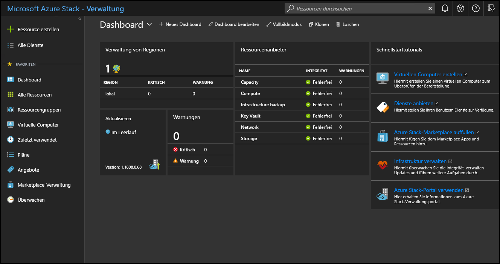

# Verwenden des Administratorportals in Azure Stack Hub

In Azure Stack Hub stehen zwei Portale zur Verfügung: das Administratorportal und das Benutzerportal. Als Azure Stack Hub-Betreiber führen Sie mit dem Administratorportal tägliche Verwaltungsaufgaben und Vorgänge in Azure Stack Hub aus.

## Zugreifen auf das Administratorportal

Rufen Sie zum Zugreifen auf das Administratorportal die Portal-URL auf, und melden Sie sich mit Ihren Azure Stack Hub-Betreiberanmeldeinformationen an. Bei einem integrierten System variiert die Portal-URL basierend auf dem Regionsnamen und dem externen vollqualifizierten Domänennamen (Fully Qualified Domain Name, FQDN) der Azure Stack Hub-Bereitstellung. Für Bereitstellungen des Azure Stack Development Kit (ASDK) ist die URL für das Administratorportal immer gleich.

| Environment | URL des Administratorportals |   
| -- | -- | 
| ASDK| https://adminportal.local.azurestack.external  |
| Integrierte Systeme | https://adminportal.&lt;*Region*&gt;.&lt;*FQDN*&gt; | 
| | |

> [!TIP]
> Bei einer ASDK-Umgebung müssen Sie zunächst sicherstellen, dass Sie über die Remotedesktopverbindung oder ein virtuelles privates Netzwerk (VPN) eine [Verbindung mit dem Development Kit-Host herstellen](../asdk/asdk-connect.md) können.

 

Die Standardzeitzone für alle Azure Stack Hub-Bereitstellungen ist auf „Koordinierte Weltzeit (UTC)“ festgelegt.

Im Administratorportal können Sie beispielsweise folgende Aufgaben ausführen:

* [Registrieren von Azure Stack Hub in Azure](azure-stack-registration.md)
* [Auffüllen des Marketplace](azure-stack-download-azure-marketplace-item.md)
* [Erstellen von Plänen, Angeboten und Abonnements für Benutzer](service-plan-offer-subscription-overview.md)
* [Überwachung von Zustand und Warnungen](azure-stack-monitor-health.md)
* [Verwalten von Azure Stack Hub-Updates](azure-stack-updates.md)

Auf der Kachel **Schnellstart-Lernprogramme** stehen Links zur Onlinedokumentation für die häufigsten Aufgaben zur Verfügung.

Ein Betreiber kann zwar im Administratorportal Ressourcen wie virtuelle Computer (VMs), virtuelle Netzwerke und Speicherkonten erstellen, Sie sollten sich jedoch [beim Benutzerportal anmelden](../user/azure-stack-use-portal.md), um Ressourcen zu erstellen und zu testen.

>[!NOTE]
>Über den Link **Virtuellen Computer erstellen** auf der Kachel des Schnellstarttutorials können Sie eine VM im Administratorportal erstellen. Diese Option dient jedoch nur zum Überprüfen der erfolgreichen Bereitstellung von Azure Stack Hub.

## Grundlegendes zum Abonnementverhalten

Im Administratorportal werden standardmäßig drei Abonnements erstellt: für den Verbrauch, den Standardanbieter und die Messung. Als Bediener verwenden Sie in erster Linie das *Standardabonnement des Anbieters*. Sie können im Administratorportal keine weiteren Abonnements hinzufügen und verwenden.

Andere Abonnements werden von Benutzern im Benutzerportal auf Grundlage der Pläne und Angebote erstellt, die Sie für diese erstellen. Über das Benutzerportal kann jedoch nicht auf die administrativen oder operativen Funktionen des Administratorportals zugegriffen werden.

Das Administratorportal und das Benutzerportal basieren auf separaten Instanzen von Azure Resource Manager. Aufgrund dieser Trennung von Azure Resource Manager sind Abonnements nicht portalübergreifend. Wenn Sie sich beispielsweise als Azure Stack Hub-Betreiber beim Benutzerportal anmelden, können Sie nicht auf das *Standardabonnement des Anbieters* zugreifen. Obwohl Sie keinen Zugriff auf administrative Funktionen haben, können Sie jedoch auf der Grundlage verfügbarer öffentlicher Angebote Abonnements für sich selbst erstellen. Solange Sie beim Benutzerportal angemeldet sind, gelten Sie als Mandantenbenutzer.

  >[!NOTE]
  >In einer ASDK-Umgebung gilt Folgendes: Wenn ein Benutzer dem gleichen Mandantenverzeichnis angehört wie der Azure Stack Hub-Betreiber, kann er sich beim Administratorportal anmelden. Er kann jedoch nicht auf die Verwaltungsfunktionen zugreifen oder Abonnements hinzufügen, um auf Angebote zuzugreifen, die im Benutzerportal nicht für ihn verfügbar sind.

## Tipps zum Administratorportal

### Anpassen des Dashboards

Das Dashboard enthält eine Reihe von Standardkacheln. Wählen Sie **Dashboard bearbeiten** aus, um das Standarddashboard anzupassen, oder wählen Sie **Neues Dashboard** aus, um ein benutzerdefiniertes Dashboard hinzuzufügen. Sie können einem Dashboard auch Kacheln hinzufügen. Wählen Sie beispielsweise **+Ressource erstellen** aus, klicken Sie mit der rechten Maustaste auf **Angebote und Pläne**, und wählen Sie dann **An Dashboard anheften** aus.

Es kann sein, dass im Portal manchmal ein leeres Dashboard angezeigt wird. Klicken Sie zum Wiederherstellen des Dashboards auf **Dashboard bearbeiten**, klicken Sie dann mit der rechten Maustaste, und wählen Sie **Auf Standardzustand zurücksetzen** aus.

### Schneller Zugriff auf Onlinedokumentation

Klicken Sie oben rechts im Administratorportal auf das Symbol „Hilfe und Support“ (Fragezeichen), um auf die Dokumentation für Azure Stack Hub-Betreiber zuzugreifen. Bewegen Sie den Cursor über das Symbol, und wählen Sie dann **Hilfe und Support** aus.

### Schneller Zugriff auf Hilfe und Support

Wenn Sie oben rechts im Administratorportal auf das Symbol „Hilfe“ (Fragezeichen) und dann auf **Hilfe und Support** und unter **Support** auf **Neue Supportanfrage** klicken, geschieht Folgendes:

- Bei Verwendung eines integrierten Systems wird mit dieser Aktion eine Website geöffnet, auf der Sie direkt ein Supportticket beim Microsoft-Kundensupport (Microsoft Customer Support Services, CSS) öffnen können. Informationen dazu, wann Sie den Microsoft-Support und wann den Support des OEM-Hardwareanbieters kontaktieren sollten, finden Sie unter [Supportquellen](azure-stack-manage-basics.md#where-to-get-support).
- Bei Verwendung des ASDK wird mit dieser Aktion direkt die [Website mit den Azure Stack Hub-Foren](https://social.msdn.microsoft.com/Forums/home?forum=AzureStack) geöffnet. Diese Foren werden regelmäßig überprüft. Da das ASDK eine Evaluierungsumgebung ist, wird über Microsoft CSS kein offizieller Support angeboten.

### Schneller Zugriff auf die Azure-Roadmap

Wenn Sie in der oberen rechten Ecke des Administratorportals **Hilfe und Unterstützung** (das Fragezeichen) und dann **Azure-Roadmap** auswählen, wird eine neue Browserregisterkarte geöffnet, über die Sie zur Azure-Roadmap gelangen. Durch Eingabe von **Azure Stack Hub** in das Suchfeld **Produkte** werden alle Updates von Azure Stack Hub-Roadmap angezeigt.

## Nächste Schritte

[Registrieren Sie Azure Stack Hub in Azure](azure-stack-registration.md), und füllen Sie den [Azure Stack Hub-Marketplace](azure-stack-marketplace.md) mit Elementen auf, die Sie für Ihre Benutzer anbieten möchten.
