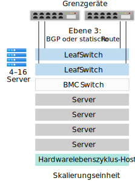
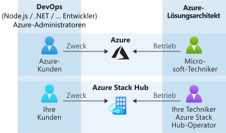

# Übersicht über Azure Stack Hub

Azure Stack Hub ist eine Erweiterung von Azure, die Ihnen die Möglichkeit bietet, Apps in einer lokalen Umgebung auszuführen und Azure-Dienste in Ihrem Rechenzentrum bereitzustellen. Mit einer einheitlichen Cloudplattform können Organisationen Entscheidungen in Bezug auf ihre Technologie ohne Bedenken auf Grundlage geschäftlicher Anforderungen treffen, anstatt geschäftliche Entscheidungen von Technologieeinschränkungen abhängig zu machen.

## Gründe für die Verwendung von Azure Stack Hub

Azure bietet Entwicklern eine umfassende Plattform für die Erstellung moderner Apps. Bei einigen cloudbasierten Apps erweisen sich die Wartezeit, zeitweilige Konnektivitätsprobleme und gesetzliche Bestimmungen jedoch als Hindernisse. Azure und Azure Stack Hub ermöglichen gänzlich neue Hybrid Cloud-Anwendungsfälle für Kundenanwendungen und interne Branchenanwendungen:

- **Edgelösungen und nicht vernetzte Lösungen:** Erfüllen Sie die Anforderungen im Hinblick auf die Wartezeit und Konnektivität, indem Sie Daten lokal in Azure Stack Hub verarbeiten und dann zur weiteren Analyse in Azure aggregieren – mit einer gemeinsamen App-Logik in beiden Umgebungen. Sie können Azure Stack Hub sogar ohne Internetverbindung bereitstellen, d. h. ohne Konnektivität mit Azure. Anwendungsbeispiele hierfür sind Fabrikhallen, Kreuzfahrtschiffe und Bergbauminen.

- **Cloud-Apps, die verschiedene Bestimmungen erfüllen:** Sie können Apps in Azure entwickeln und bereitstellen. Dank vollständiger Flexibilität können sie dieselben Anwendungen mithilfe von Azure Stack Hub in Ihrer lokalen Umgebung bereitstellen, um gesetzliche oder richtlinienbasierte Anforderungen zu erfüllen. Hierzu sind keine Codeänderungen erforderlich. App-Beispiele hierfür sind globale Überwachung, Finanzberichte, Devisenhandel, Onlinespiele und Spesenabrechnungen.

- **Lokales Cloud-App-Modell:** Nutzen Sie Azure-Dienste, Container, serverlose Architekturen und Microservicearchitekturen, um vorhandene Apps zu aktualisieren oder zu erweitern oder um neue Apps zu erstellen. Nutzen Sie konsistente DevOps-Prozesse in Azure in der Cloud und lokal in Azure Stack Hub, um die Modernisierung zentraler, unternehmenskritischer Apps zu beschleunigen.

## Architektur von Azure Stack Hub

Integrierte Azure Stack Hub-Systeme bestehen aus Racks mit 4 bis 16 Servern von vertrauenswürdigen Hardwarepartnern und werden direkt an Ihr Rechenzentrum geliefert. Ein Lösungsanbieter stellt das integrierte System nach der Lieferung gemeinsam mit Ihnen bereit und stellt sicher, dass die Azure Stack Hub-Lösung Ihre geschäftlichen Anforderungen erfüllt. Sie können das Rechenzentrum vorbereiten, indem Sie sicherstellen, dass die gesamte erforderliche Stromversorgung und Kühlung, die Grenzkonnektivität und andere erforderliche Komponenten für die Rechenzentrumsintegration vorhanden sind.

> Weitere Informationen zur Rechenzentrumsintegration von Azure Stack Hub finden Sie unter [Azure Stack Hub-Rechenzentrumsintegration](azure-stack-customer-journey.md).

Azure Stack Hub basiert auf Hardware nach Industriestandard und wird mit den gleichen Tools verwaltet, die Sie bereits für die Verwaltung von Azure-Abonnements verwenden. Daher können Sie unabhängig davon, ob Sie mit Azure verbunden sind oder nicht, konsistente DevOps-Prozesse anwenden.

Für Remotestandorte, bei zeitweiligen Konnektivitätsproblemen oder für den Betrieb ohne Internetverbindung ermöglicht die Azure Stack Hub-Architektur Ihnen die Bereitstellung von Azure-Diensten im Edgebereich. Sie können Hybridlösungen erstellen, die Daten lokal in Azure Stack Hub verarbeiten und dann zur weiteren Verarbeitung und Analyse in Azure aggregieren. Und da Azure Stack Hub lokal installiert ist, haben Sie die Flexibilität, Cloud-Apps zur Erfüllung von spezifischen gesetzlichen Bestimmungen oder Richtlinienanforderungen lokal bereitzustellen, ohne auch nur eine einzige Zeile Code zu ändern.

## Bereitstellungsoptionen

Integrierte Azure Stack Hub-Systeme werden im Rahmen einer Partnerschaft zwischen Microsoft und Hardwarepartnern angeboten. Dadurch entsteht eine Lösung mit cloudbasierten Innovationen und komfortabler Computeverwaltung. Als integriertes Hardware- und Softwaresystem bietet Ihnen Azure Stack Hub nicht nur genau die Flexibilität und Kontrolle, die Sie benötigen, sondern auch die Möglichkeit zur Nutzung innovativer Cloudfeatures.

Ein integriertes Azure Stack Hub-System kann eine Größe von 4 bis 16 Servern haben. Dies wird als *Skalierungseinheit* bezeichnet. Integrierte Systeme werden gemeinsam vom Hardwarepartner und von Microsoft unterstützt. Das folgende Diagramm zeigt ein Beispiel einer Skalierungseinheit: 

erforderlich. 

<!---add info and image on regions, etc--->

### Verbindungsmodelle

Sie können Azure Stack Hub entweder mit dem Internet (und mit Azure) **verbunden** oder **ohne Verbindung** bereitstellen. 

> Weitere Informationen finden Sie in den Überlegungen zu [verbundenen](azure-stack-connected-deployment.md) und [nicht verbundenen](azure-stack-disconnected-deployment.md) Bereitstellungsmodellen.

### Identitätsanbieter 

Azure Stack Hub verwendet entweder Azure Active Directory (Azure AD) oder Active Directory-Verbunddienste (AD FS). Azure AD ist der cloudbasierte, mehrinstanzenfähige Identitätsanbieter von Microsoft. Für die meisten Hybridszenarien mit Bereitstellungen mit Internetverbindung wird Azure AD als Identitätsspeicher verwendet.

Für getrennte Bereitstellungen von Azure Stack Hub müssen Sie AD FS verwenden. Azure Stack Hub-Ressourcenanbieter und andere Apps funktionieren mit AD FS oder Azure AD auf ähnliche Weise. Azure Stack Hub umfasst eine eigene Active Directory-Instanz und eine Active Directory Graph-API.

## Wie wird Azure Stack Hub verwaltet?

Azure Stack Hub verwendet das gleiche Betriebsmodell wie Azure. Ein Azure Stack Hub-Betreiber kann Mandantenbenutzern eine Vielzahl von Diensten und Apps zur Verfügung stellen. Dies ist mit der Bereitstellung von Azure-Diensten für Mandantenbenutzer durch Microsoft vergleichbar. 

Sie können Azure Stack Hub über das Administratorportal, das Benutzerportal oder mit [PowerShell](/powershell/azure/azure-stack/overview?view=azurestackps-1.7.1) verwalten. Alle Azure Stack Hub-Portale basieren jeweils auf separaten Azure Resource Manager-Instanzen. Ein **Azure Stack Hub-Betreiber** verwendet das Administratorportal, um Azure Stack Hub zu verwalten und Aufgaben wie das Erstellen von Mandantenangeboten, Sicherstellen der Integrität und Überwachen des Status des integrierten Systems auszuführen. Das Benutzerportal bietet eine Self-Service-Benutzeroberfläche für die Nutzung von Cloudressourcen wie virtuelle Computer, Speicherkonten und Web-Apps.

> Weitere Informationen zum Verwalten von Azure Stack Hub über das Administratorportal finden Sie unter [Schnellstart: Verwenden des Azure Stack Hub-Verwaltungsportals](azure-stack-manage-portals.md).

Als Azure Stack Hub-Betreiber können Sie [VMs](./tutorial-offer-services.md?view=azs-2002), [Web-Apps](azure-stack-app-service-overview.md) sowie hochverfügbare [SQL Server](azure-stack-tutorial-sql.md)-Datenbanken und [MySQL](azure-stack-tutorial-mysql.md)-Serverdatenbanken bereitstellen. Sie können auch [Azure Resource Manager-Schnellstartvorlagen für Azure Stack Hub](https://github.com/Azure/AzureStack-QuickStart-Templates) zum Bereitstellen von SharePoint, Exchange usw. verwenden.

Ein Betreiber kann Azure Stack Hub über das [Administratorportal](azure-stack-manage-portals.md) oder mit [PowerShell](/powershell/azure/azure-stack/overview?view=azurestackps-1.7.1) verwalten. Sie können Azure Stack Hub zur [Bereitstellung von Diensten](service-plan-offer-subscription-overview.md) für Mandanten mit Plänen, Kontingenten, Angeboten und Abonnements konfigurieren. Mandantenbenutzer können mehrere Angebote abonnieren. Angebote können einen oder mehrere Pläne enthalten und die Pläne wiederum einen oder mehrere Dienste. Betreiber können auch die Kapazität verwalten und auf Warnungen reagieren.

Benutzer nutzen Dienste, die der Betreiber anbietet. Benutzer können Dienste, die sie abonniert haben – z. B. Web-Apps, Speicher und virtuelle Computer – bereitstellen, überwachen und verwalten. Benutzer können Azure Stack Hub über das Benutzerportal oder mit PowerShell verwalten.

> Weitere Informationen zum Verwalten von Azure Stack Hub finden Sie unter [Grundlagen zur Verwaltung von Azure Stack Hub](azure-stack-manage-basics.md). Dort erfahren Sie u. a., welche Konten wo verwendet werden müssen, welche typischen Aufgaben zum Zuständigkeitsbereich des Betreibers zählen, welche Informationen Sie Ihren Benutzern mitteilen müssen und wo Sie Hilfe erhalten.

## Ressourcenanbieter

Ressourcenanbieter sind Webdienste, die die Grundlage für alle IaaS- und PaaS-Dienste von Azure Stack Hub bilden. Azure Resource Manager nutzt verschiedene Ressourcenanbieter, um den Zugriff auf Dienste zu ermöglichen. Mit diesen Ressourcenanbietern können Sie die zugehörigen Ressourcen konfigurieren und steuern. Dienstadministratoren können auch neue benutzerdefinierte Ressourcenanbieter hinzufügen.

### Grundlegende Ressourcenanbieter

Es gibt drei grundlegende IaaS-Ressourcenanbieter (Infrastructure-as-a-Service):

- **Compute**: Mit dem Computeressourcenanbieter können Azure Stack Hub-Mandanten eigene VMs erstellen. Der Computeressourcenanbieter bietet die Möglichkeit, VMs und VM-Erweiterungen zu erstellen. Der Erweiterungsdienst für virtuelle Computer unterstützt die Bereitstellung von IaaS-Funktionen für virtuelle Windows- und Linux-Computer. Beispielsweise können Sie den Computeressourcenanbieter zum Bereitstellen einer Linux-VM verwenden und während der Bereitstellung Bash-Skripts ausführen, um die VM zu konfigurieren.
- **Netzwerkressourcenanbieter:** Der Netzwerkressourcenanbieter bietet eine Reihe von Features für Software-Defined Networking (SDN) und Netzwerkfunktionsvirtualisierung (Network Function Virtualization, NFV) für die private Cloud. Mit dem Netzwerkressourcenanbieter können Sie Ressourcen wie Software-Lastenausgleichsmodule, öffentliche IP-Adressen, Netzwerksicherheitsgruppen und virtuelle Netzwerke erstellen.
- **Speicherressourcenanbieter:** Der Speicherressourcenanbieter umfasst vier mit Azure konsistente Speicherdienste: [Blob](/azure/storage/common/storage-introduction#blob-storage), [Warteschlange](/azure/storage/common/storage-introduction#queue-storage), [Tabelle](/azure/storage/common/storage-introduction#table-storage) und [Key Vault](/azure/key-vault/)-Kontoverwaltung mit Funktionen zur Verwaltung und Überwachung von Geheimnissen (z. B. Kennwörter und Zertifikate). Der Speicherressourcenanbieter bietet außerdem einen Speichercloud-Verwaltungsdienst, um die Dienstanbieterverwaltung von Speicherdiensten zu vereinfachen, die mit Azure konsistent sind. Azure Storage bietet die Flexibilität zum Speichern und Abrufen großer Mengen von unstrukturierten Daten, z. B. Dokumenten und Mediendateien mit Azure-Blobs, und von strukturierten NoSQL-basierten Daten mit Azure-Tabellen.

### Optionale Ressourcenanbieter

Es gibt drei optionale PaaS-Ressourcenanbieter (Platform-as-a-Service), die Sie bereitstellen und mit Azure Stack Hub verwenden können:

- **App Service**: [Azure App Service in Azure Stack Hub](azure-stack-app-service-overview.md) ist ein PaaS-Angebot von Microsoft Azure, das für Azure Stack verfügbar ist. Mit diesem Dienst können Ihre internen oder externen Kunden Web-, API- und Azure Functions-Apps für beliebige Plattformen oder Geräte erstellen.
- **SQL Server:** Verwenden Sie den [SQL Server-Ressourcenanbieter](azure-stack-sql-resource-provider.md), um SQL-Datenbanken als Dienst in Azure Stack Hub anzubieten. Nachdem Sie den Ressourcenanbieter installiert und mit mindestens einer SQL Server-Instanz verbunden haben, können Sie und Ihre Benutzer Datenbanken für cloudnative Apps, Websites mit SQL-Nutzung und andere Workloads mit SQL erstellen.
- **MySQL Server:** Verwenden Sie den [MySQL-Server-Ressourcenanbieter](azure-stack-mysql-resource-provider-deploy.md), um MySQL-Datenbanken als Azure Stack Hub-Dienst verfügbar zu machen. Der MySQL-Ressourcenanbieter wird als Dienst auf einem virtuellen Windows Server 2019 Server Core-Computer ausgeführt.

## Nächste Schritte

[Vergleichen des Azure Stack Hub-Portfolios](compare-azure-azure-stack.md)

[Verwaltungsgrundlagen](azure-stack-manage-basics.md)

[Schnellstart: Verwenden des Azure Stack Hub-Verwaltungsportals](azure-stack-manage-portals.md)

[Grundlegendes zu Nutzung und Abrechnung](azure-stack-usage-reporting.md)
