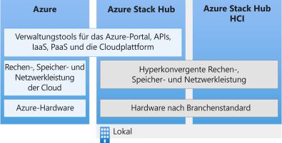

# Unterschiede zwischen der globalen Azure-Infrastruktur, Azure Stack Hub und Azure Stack HCI

Azure und die Familie der Azure Stack Hub-Dienste werden von Microsoft in einer Azure-Infrastruktur bereitgestellt. Verwenden Sie unabhängig davon, ob Ihr Unternehmen eine globale Azure-Infrastruktur oder lokale Ressourcen nutzt, dasselbe Anwendungsmodell, Self-Service-Portale und APIs mit Azure Resource Manager, um cloudbasierte Funktionen bereitzustellen.

In diesem Artikel werden die Unterschiede zwischen der globalen Azure-Infrastruktur, Azure Stack Hub und Azure Stack HCI erläutert. Er enthält zudem Empfehlungen zu häufigen Szenarien, damit Sie die bestmögliche Auswahl treffen können, wenn es um die Bereitstellung von cloudbasierten Microsoft-Diensten für Ihre Organisation geht.

## Globale Azure-Umgebung

Bei Microsoft Azure handelt es sich um Clouddienste, die stetig erweitert werden, um Ihre Organisation bei geschäftlichen Herausforderungen zu unterstützen. Sie können Apps mit Ihren bevorzugten Tools und Frameworks in einem großen globalen Netzwerk erstellen, verwalten und bereitstellen.

Über die globale Azure-Infrastruktur werden mehr als 100 Dienste angeboten, die in 54 Regionen weltweit verfügbar sind. Die aktuelle Liste mit den globalen Azure-Diensten finden Sie unter [*Verfügbare Produkte nach Region*](https://azure.microsoft.com/regions/services). Die in Azure verfügbaren Dienste sind nach Kategorie und danach aufgeführt, ob sie bereits allgemein verfügbar sind oder sich noch in der Vorschauphase befinden.

Weitere Informationen zu globalen Azure-Diensten finden Sie auf der [Seite zu den ersten Schritten mit Azure](/azure/?panel=get-started1&pivot=get-started).

## Azure Stack Hub

Azure Stack Hub ist eine Erweiterung von Azure, die für Ihre lokale Umgebung die Flexibilität und das Innovationspotenzial des Cloud Computing ermöglicht. Bei lokaler Bereitstellung kann Azure Stack Hub genutzt werden, um einheitliche Azure-Dienste bereitzustellen – entweder mit Internetverbindung (und Azure-Verbindung) oder in Umgebungen ohne Internetverbindung. Für Azure Stack Hub wird die gleiche zugrunde liegende Technologie wie für die globale Azure-Infrastruktur verwendet. Dazu zählen die Kernkomponenten IaaS (Infrastructure-as-a-Service), SaaS (Software-as-a-Service) und optional PaaS (Platform-as-a-Service). Diese Funktionen umfassen:

- Azure-VMs für Windows und Linux
- Azure Web Apps und Functions
- Azure-Schlüsseltresor
- Azure Resource Manager
- Azure Marketplace
- Container
- Verwaltungstools (Pläne, Angebote, rollenbasierte Zugriffssteuerung usw.)

Die PaaS-Funktionen von Azure Stack Hub sind optional, weil Azure Stack Hub nicht von Microsoft betrieben wird, sondern von unseren Kunden. Dies bedeutet, dass Sie Endbenutzern jeden gewünschten PaaS-Dienst anbieten können, wenn Sie darauf vorbereitet sind, die zugrunde liegende Infrastruktur und die Prozesse für den Endbenutzer zu abstrahieren. Azure Stack Hub verfügt aber über mehrere optionale PaaS-Dienstanbieter, z. B. App Service, SQL-Datenbanken und MySQL-Datenbanken. Diese werden als Ressourcenanbieter bereitgestellt. Sie sind daher mehrinstanzenfähig, werden regelmäßig mit Azure Stack Hub-Standardupdates aktualisiert, sind im Azure Stack Hub-Portal sichtbar und sind gut in Azure Stack Hub integriert.

Zusätzlich zu den oben beschriebenen Ressourcenanbietern sind noch zusätzliche PaaS-Dienste verfügbar, die als [Lösungen auf Basis von Azure Resource Manager-Vorlagen](https://github.com/Azure/AzureStack-QuickStart-Templates) getestet wurden und in IaaS ausgeführt werden. Sie als Azure Stack Hub-Operator können sie Ihren Benutzern als PaaS-Dienste anbieten, z. B.:

- Service Fabric
- Kubernetes Container Service
- Ethereum-Blockchain
- Cloud Foundry

### Beispiele für Azure Stack Hub-Anwendungsfälle

- Finanzmodelle
- Klinische Daten und Daten zur Geltendmachung von Ansprüchen
- IoT-Geräteanalysen
- Sortimentsoptimierung für Einzelhandel
- Optimierung der Lieferkette
- Industrielles IoT
- Predictive Maintenance
- Smart City
- Bürgereinbindung

Weitere Informationen zu Azure Stack Hub finden Sie unter [Was ist Azure Stack Hub?](azure-stack-overview.md).

## Azure Stack HCI

[Azure Stack HCI](../hci/overview.md) ist ein hyperkonvergenter Cluster, bei dem überprüfte Hardware eingesetzt wird, um virtualisierte Windows- und Linux-Workloads lokal auszuführen und eine einfache Verbindungsherstellung mit Azure für die cloudbasierte Sicherung, Wiederherstellung und Überwachung zu ermöglichen. Azure Stack HCI basiert ursprünglich auf Windows Server 2019 und wird jetzt als Azure-Dienst mit einem abonnementbasierten Lizenzierungsmodell und integrierten Hybridfunktionen bereitgestellt. Obwohl Azure Stack HCI auf den gleichen Betriebssystem-Hauptkomponenten wie Windows Server basiert, handelt es sich um eine völlig neue Produktlinie, bei der es um die Erzielung des bestmöglichen Virtualisierungshosts geht.

Für Azure Stack HCI wird von Microsoft überprüfte Hardware eines OEM-Partners verwendet, um eine optimale Leistung und Zuverlässigkeit sicherzustellen. Die Lösungen beinhalten Unterstützung für Technologien wie NVMe-Laufwerke, persistenten Speicher und RDMA-Netzwerke (Remote-Direct Memory Access, Remotezugriff auf den direkten Speicher).

### Beispiele für Azure Stack HCI-Anwendungsfälle

- Remote- oder Filialsysteme
- Konsolidierung von Rechenzentren
- Virtuelle Desktopinfrastruktur
- Unternehmenskritische Infrastruktur
- Kostengünstige Speicherung
- Hochverfügbarkeit und Notfallwiederherstellung in der Cloud
- Virtualisieren von Unternehmens-Apps, z. B. SQL Server

Besuchen Sie die [Azure Stack HCI-Website](https://azure.microsoft.com/overview/azure-stack/hci/), um sich über die mehr als 70 Azure Stack HCI-Lösungen zu informieren, die Microsoft-Partner derzeit im Angebot haben.

## Nächste Schritte

[Grundlagen zur Verwaltung von Azure Stack Hub](azure-stack-manage-basics.md)

[Schnellstart: Verwenden des Azure Stack Hub-Verwaltungsportals](azure-stack-manage-portals.md)
