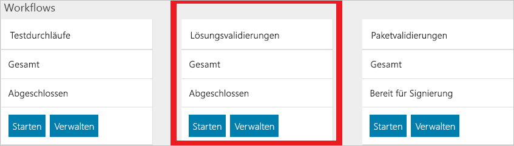
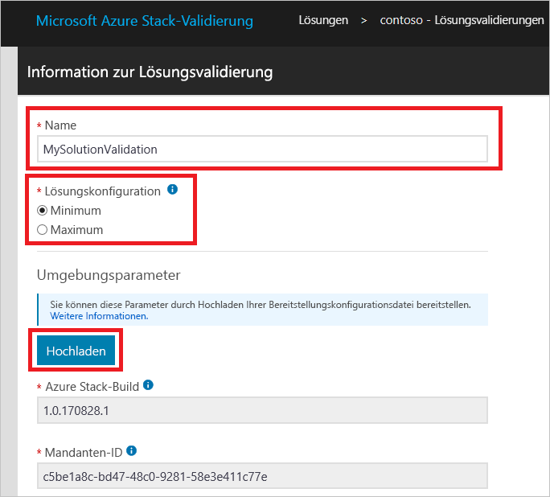
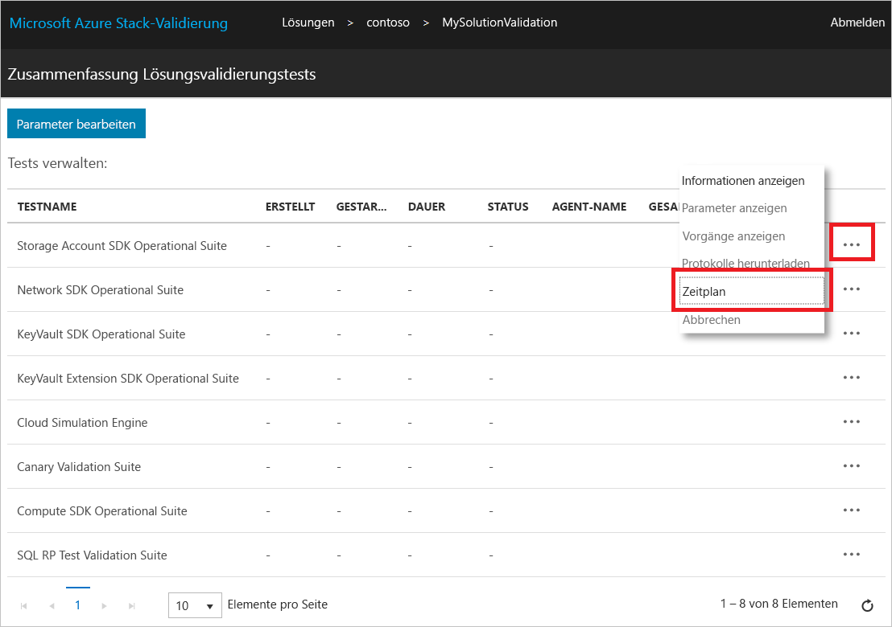

# Überprüfen einer Lösung in Azure Stack Hub

[!INCLUDE [Azure_Stack_Partner](./includes/azure-stack-partner-appliesto.md)]

Hier erfahren Sie, wie Sie mithilfe des Workflows **Lösungsvalidierung** neue Azure Stack Hub-Lösungen überprüfen.

Eine Azure Stack Hub-Lösung ist eine Hardwareliste, auf die sich Microsoft und der Partner nach Erfüllung der Anforderungen für die Windows Server-Logozertifizierung geeinigt haben. Nach einer Änderung der Hardwareliste muss die Lösung erneut zertifiziert werden. Sollten Sie weitere Fragen zur erneuten Überprüfung von Lösungen haben, wenden Sie sich unter [vaashelp@microsoft.com](mailto:vaashelp@microsoft.com) an das zuständige Team.

Führen Sie den Workflow „Lösungsvalidierung“ zweimal aus, um Ihre Lösung zu überprüfen. Führen Sie ihn einmal für die unterstützte *minimale* Konfiguration aus. Führen Sie ihn ein zweites Mal für die *maximale* unterstützte Konfiguration aus. Microsoft überprüft die Lösung, wenn beide Konfigurationen alle Tests bestehen.

[!INCLUDE [azure-stack-vaas-workflow-validation-completion](includes/azure-stack-vaas-workflow-validation-completion.md)]

## Erstellen eines Lösungsvalidierungsworkflows

1. [!INCLUDE [azure-stack-vaas-workflow-step_select-solution](includes/azure-stack-vaas-workflow-step_select-solution.md)]

2. Klicken Sie auf der Kachel **Solution Validations** (Lösungsvalidierungen) auf **Starten**.

    

3. [!INCLUDE [azure-stack-vaas-workflow-step_naming](includes/azure-stack-vaas-workflow-step_naming.md)]

4. Wählen Sie die **Lösungskonfiguration** aus.
    - **Minimum**: Die Lösung wird mit der unterstützten Mindestanzahl von Knoten konfiguriert.
    - **Maximum**: Die Lösung wird mit der maximal unterstützten Anzahl von Knoten konfiguriert.
5. [!INCLUDE [azure-stack-vaas-workflow-step_upload-stampinfo](includes/azure-stack-vaas-workflow-step_upload-stampinfo.md)]

    

6. [!INCLUDE [azure-stack-vaas-workflow-step_test-params](includes/azure-stack-vaas-workflow-step_test-params.md)]

    > [!NOTE]
    > Umgebungsparameter können nach der Workflowerstellung nicht mehr geändert werden.

7. [!INCLUDE [azure-stack-vaas-workflow-step_tags](includes/azure-stack-vaas-workflow-step_tags.md)]
8. [!INCLUDE [azure-stack-vaas-workflow-step_submit](includes/azure-stack-vaas-workflow-step_submit.md)]
    Sie werden auf die Seite mit der Testzusammenfassung umgeleitet.

## Ausführen von Lösungsvalidierungstests

Auf der Zusammenfassungsseite der **Lösungsvalidierungstests** wird eine Liste mit den erforderlichen Tests für die Überprüfung angezeigt.

In den Validierungsworkflows werden beim **Planen** eines Tests die allgemeinen Parameter auf der Workflowebene verwendet, die Sie bei der Workflowerstellung angegeben haben (siehe [Allgemeine Workflowparameter für Validation-as-a-Service in Azure Stack Hub](azure-stack-vaas-parameters.md)). Sollte einer der Testparameterwerte ungültig werden, muss er gemäß den Anweisungen unter [Ändern von Workflowparametern](azure-stack-vaas-monitor-test.md#change-workflow-parameters) erneut angegeben werden.

> [!NOTE]
> Wenn Sie einen Validierungstest für eine bereits vorhandene Instanz planen, wird die alte Instanz im Portal durch eine neu erstellte Instanz ersetzt. Die Protokolle für die alte Instanz bleiben erhalten, können aber nicht über das Portal verwendet werden. 
Nach erfolgreicher Ausführung eines Tests wird die **Planungsoption** deaktiviert.

1. [!INCLUDE [azure-stack-vaas-workflow-step_select-agent](includes/azure-stack-vaas-workflow-step_select-agent.md)]

2. Wählen Sie die folgenden Tests aus:
    - Cloud-Simulationsmodul
    - Disk Identification Test

3. Klicken Sie im Kontextmenü auf **Planen**, um eine Eingabeaufforderung für die Planung der Testinstanz zu öffnen.

4. Überprüfen Sie die Testparameter, und klicken Sie anschließend auf **Absenden**, um die Testausführung zu planen.

## Nächste Schritte

- [Überwachen und Verwalten von Tests im VaaS-Portal](azure-stack-vaas-monitor-test.md)