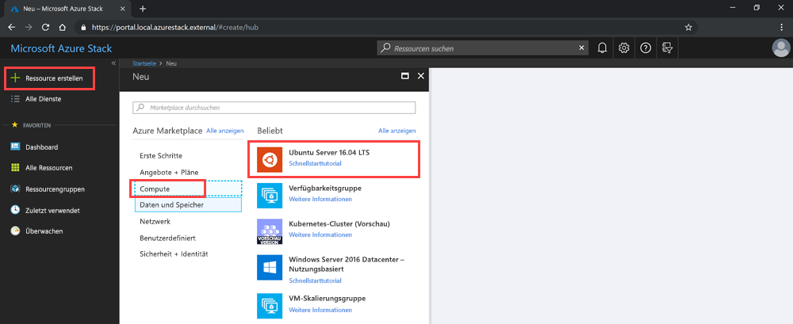

# <a name="deploy-a-linux-vm-to-host-a-web-app-in-azure-stack-hub"></a>Bereitstellen einer Linux-VM zum Hosten einer Web-App in Azure Stack Hub

Sie können einen einfachen virtuellen Linux-Computer mit dem Ubuntu-Image im Azure Marketplace erstellen und bereitstellen, um eine Web-App zu hosten, die Sie mit einem Webframework erstellt haben. 

Dieser virtuelle Computer kann Web-Apps mithilfe folgender Komponenten hosten:

- **Python**: Häufige Python-Webframeworks wie Flask, Bottle und Django.
- **Go**: Häufige GO-Frameworks wie Revel, Martini, Gocraft/Web und Gorilla. 
- **Ruby**: Richten Sie Ruby on Rails als Framework zum Bereitstellen Ihrer Ruby-Web-Apps ein. 
- **Java**: Verwenden Sie Java zum Entwickeln von Web-Apps, die Sie auf einem Apache Tomcat-Server veröffentlichen. Sie können Tomcat auf Linux installieren und Ihre Java-WAR-Dateien dann direkt auf dem Server bereitstellen. 

Lesen Sie die Anleitungen in diesem Artikel, um beliebige Web-Apps, Frameworks und Back-End-Technologien einzurichten und auszuführen, die das Linux-Betriebssystem verwenden. Mit Azure Stack Hub verwalten Sie Ihre Infrastruktur, und mit den Verwaltungstools der von Ihnen verwendeten Technologie führen Sie Wartungsaufgaben für Ihre App aus.

## <a name="deploy-a-linux-vm-for-a-web-app"></a>Bereitstellen einer Linux-VM für eine Web-App

Sie erstellen in diesem Prozess einen geheimen Schlüssel, verwenden das Basisimage der Linux-VM, geben die spezifischen Attribute der VM an und erstellen dann die VM. Nachdem Sie den virtuellen Computer erstellt haben, öffnen Sie die Ports, die zum Arbeiten mit dem virtuellen Computer und für den virtuellen Computer zum Hosten Ihrer App erforderlich sind. Als Nächstes erstellen Sie den DNS-Namen. Dann stellen Sie eine Verbindung mit dem virtuellen Computer her und aktualisieren den Computer mithilfe von „apt-get“. Nachdem Sie den Vorgang abgeschlossen haben, besitzen Sie einen virtuellen Computer in Ihrer Azure Stack Hub-Instanz, der zum Hosten Ihrer Web-App bereit ist.

Stellen Sie zu Beginn sicher, dass alle erforderlichen Komponenten vorhanden sind.

## <a name="prerequisites"></a>Voraussetzungen

- Ein Azure Stack Hub-Abonnement mit Zugriff auf das Ubuntu Server 16.04 LTS-Image. Sie können eine höhere Version dieses Images verwenden, die vorliegenden Anleitungen wurden aber für 16.04 LTS konzipiert. Wenn Sie nicht über dieses Image verfügen, wenden Sie sich an Ihren Cloudbetreiber, damit das Image in Ihrem Azure Stack Hub-Marketplace bereitgestellt wird.

## <a name="deploy-the-vm-by-using-the-portal"></a>Bereitstellen des virtuellen Computers über das Portal

Führen Sie zum Bereitstellen des virtuellen Computers die Anweisungen in den folgenden Abschnitten aus.

### <a name="create-your-vm"></a>Erstellen Ihres virtuellen Computers

1. Erstellen Sie einen öffentlichen SSH-Schlüssel (Secure Shell) für Ihren Server. Weitere Informationen finden Sie unter [Verwenden eines öffentlichen SSH-Schlüssels](azure-stack-dev-start-howto-ssh-public-key.md).
1. Wählen Sie im Azure Stack Hub-Portal **Ressource erstellen** > **Compute** > **Ubuntu Server 16.04 LTS** aus.

    

4. Gehen Sie im Bereich **Erstellen eines virtuellen Computers** für **1. Grundeinstellungen konfigurieren** folgendermaßen vor:

    a. Geben Sie den **Namen Ihres virtuellen Computers** ein.

    b. Wählen Sie als **VM-Datenträgertyp** entweder **SSD Premium** (für Premium-Datenträger [SSD]) oder **HDD Standard** (für Standard-Datenträger [HDD]) aus.

    c. Geben Sie Ihren **Benutzernamen** ein.

    d. Wählen Sie **Öffentlicher SSH-Schlüssel** als **Authentifizierungstyp** aus.

    e. Rufen Sie den öffentlichen SSH-Schlüssel ab, den Sie erstellt haben. Öffnen Sie den Schlüssel in einem Text-Editor. Kopieren Sie den Schlüssel, und fügen Sie ihn in das Feld **Öffentlicher SSH-Schlüssel** ein. Schließen Sie den Text von `---- BEGIN SSH2 PUBLIC KEY ----` bis `---- END SSH2 PUBLIC KEY ----` ein. Fügen Sie den gesamten Textblock in das Schlüsselfeld ein:

    ```text  
    ---- BEGIN SSH2 PUBLIC KEY ----
    Comment: "rsa-key-20190207"
    <Your key block>
    ---- END SSH2 PUBLIC KEY ----
    ```

    f. Wählen Sie das Abonnement für Ihre Azure Stack Hub-Instanz aus.

    g. Erstellen Sie eine neue Ressourcengruppe, oder verwenden Sie eine vorhandene Ressourcengruppe – je nachdem, wie Sie Ressourcen für Ihre App organisieren möchten.

    h. Wählen Sie Ihren Standort aus. Das Azure Stack Development Kit (ASDK) befindet sich in der Regel in einer *lokalen* Region. Der Standort hängt von Ihrer Azure Stack Hub-Instanz ab.
1. Geben Sie für **2. Größe** Folgendes ein:
    - Wählen Sie die Größe der Daten und den Arbeitsspeicher für Ihren virtuellen Computer aus, der in Ihrer Azure Stack Hub-Instanz verfügbar ist.
    - Sie können die Liste durchsuchen oder nach der Größe Ihres virtuellen Computers filtern, indem Sie **Computetyp**, **CPUs** und **Speicherplatz** auswählen.
    
    > [!NOTE]
    > - Bei den angezeigten Preisen handelt es sich um Schätzungen in Ihrer lokalen Währung. Sie umfassen nur Azure-Infrastrukturkosten und anwendbare Rabatte für das Abonnement und den Standort. In den Preisen sind keine Kosten für Software enthalten. 
    > - Die empfohlene Größen werden durch den Herausgeber des ausgewählten Images festgelegt und basieren auf Hardware- und Softwareanforderungen.
    > - Wenn Sie anstelle von Premium-Datenträgern (SSD) Standard-Datenträger (HDD) verwenden, verschlechtert sich möglicherweise die Leistung des Betriebssystems.

1. Geben Sie unter **3. Optionale Features konfigurieren** Folgendes ein:

    a. Wählen Sie unter **Hochverfügbarkeit** eine Verfügbarkeitsgruppe. Um Redundanz für Ihre Anwendung zu gewährleisten, gruppieren Sie zwei oder mehr virtuelle Computer in einer Verfügbarkeitsgruppe. Durch diese Konfiguration wird sichergestellt, dass während eines geplanten oder ungeplanten Wartungsereignisses mindestens ein virtueller Computer verfügbar ist und die durch das Azure Service-Level Agreement (SLA) zugesicherte Verfügbarkeit von 99,95 % eingehalten wird. Die Verfügbarkeitsgruppe eines virtuellen Computers kann nach dem Erstellen nicht mehr geändert werden.

    b. Wählen Sie als **Speicher** die Option **Premium-Datenträger (SSD)** oder **Standard-Datenträger (HDD)** aus. Premium-Datenträger (SSD) basieren auf Solid State Drives und bieten konsistente Leistung mit geringen Wartezeiten. Sie bieten das beste Preis-Leistungs-Verhältnis und eignen sich ideal für E/A-intensive Anwendungen und Produktionsworkloads. Standard-Datenträger basieren auf magnetischen Laufwerken und werden für Anwendungen bevorzugt, in denen nur selten auf Daten zugegriffen wird. Zonenredundante Datenträger basieren auf zonenredundantem Speicher (ZRS), der Ihre Daten in mehreren Zonen repliziert, und sind auch dann verfügbar, wenn eine einzelne Zone ausfällt. 

    c. Wählen Sie **Verwaltete Datenträger verwenden**. Wenn Sie dieses Feature aktivieren, wird die Verfügbarkeit von Datenträgern von Azure automatisch verwaltet. Sie profitieren von Datenredundanz und Fehlertoleranz, ohne selbst Speicherkonten erstellen und verwalten zu müssen. Verwaltete Datenträger sind möglicherweise nicht in allen Regionen verfügbar. Weitere Informationen finden Sie unter [Einführung in verwaltete Azure-Datenträger](https://docs.microsoft.com/azure/virtual-machines/windows/managed-disks-overview).

    d. Klicken Sie auf **Virtuelles Netzwerk**, um Ihr Netzwerk zu konfigurieren. Virtuelle Netzwerke sind in Azure logisch voneinander isoliert. Sie können ihre IP-Adressbereiche, Subnetze, Routingtabellen, Gateways und Sicherheitseinstellungen wie bei einem herkömmlichen Netzwerk in Ihrem Rechenzentrum konfigurieren. Virtuelle Computer im gleichen virtuellen Netzwerk können standardmäßig aufeinander zugreifen. 

    e. Wählen Sie zum Konfigurieren Ihres Subnetzes **Subnetz**. Ein Subnetz ist ein Bereich von IP-Adressen in Ihrem virtuellen Netzwerk. Sie können ein Subnetz verwenden, um virtuelle Computer voneinander oder vom Internet zu isolieren. 

    f. Wählen Sie **öffentliche IP-Adresse** aus, um den Zugriff auf Ihren virtuellen Computer oder auf die auf Ihrem virtuellen Computer ausgeführten Dienste zu konfigurieren. Verwenden Sie eine öffentliche IP-Adresse, um von außerhalb des virtuellen Netzwerks mit einem virtuellen Computer zu kommunizieren. 

    g. Wählen Sie unter **Netzwerksicherheitsgruppe** die Option **Einfach** oder **Erweitert**. Legen Sie die Regeln fest, mit denen der Netzwerkdatenverkehr an den virtuellen Computer zugelassen oder verweigert wird. 

    h. Wählen Sie **Öffentliche Eingangsports**, um den Zugriff allgemeiner oder benutzerdefinierter Protokolle auf Ihren virtuellen Computer festzulegen. Der Dienst gibt das Zielprotokoll und den Portbereich für diese Regel an. Sie können einen vordefinierten Dienst wie RDP oder SSH wählen oder einen benutzerdefinierten Portbereich angeben. 
        Verwenden Sie für den Webserver HTTP (80), HTTPS (443) und SSH (22). Wenn Sie den Computer über eine RDP-Verbindung verwalten möchten, öffnen Sie Port 3389.

    i. Wählen Sie **Erweiterungen** aus, um Erweiterungen auf Ihren virtuellen Computer hinzuzufügen. Mit Erweiterungen fügen Sie Ihrem virtuellen Computer neue Features wie z. B. Konfigurationsverwaltung oder Virenschutz hinzu. 

    j. Aktivieren oder deaktivieren Sie die **Überwachung**. Zum Diagnostizieren von Startproblemen können Sie mit der Überwachung die Ausgabe der seriellen Konsole und Screenshots von auf einem Host ausgeführten virtuellen Computern erfassen. 

    k. Um das Speicherkonto anzugeben, die Ihre Metriken enthält, wählen Sie **Diagnosespeicherkonto**. Metriken werden in ein Speicherkonto geschrieben, sodass Sie sie mit Ihren eigenen Tools analysieren können. 

    l. Klicken Sie auf **OK**.

1. Überprüfen Sie **4. Zusammenfassung**:
    - Das Portal überprüft Ihre Einstellungen.
    - Wenn Sie Ihre Einstellungen mit einem Azure Resource Manager-Workflow wiederverwenden möchten, können Sie die Azure Resource Manager-Vorlage für Ihren virtuellen Computer herunterladen.
    - Wählen Sie nach erfolgreicher Überprüfung **OK** aus. Die Bereitstellung des virtuellen Computers dauert einige Minuten.

### <a name="specify-the-open-ports-and-dns-name"></a>Festlegen von offenen Ports und DNS-Namen

Wenn Sie Benutzern in Ihrem Netzwerk Ihre Web-App zur Verfügung stellen möchten, öffnen Sie die zum Herstellen einer Verbindung mit dem Computer verwendeten Ports und fügen einen benutzerfreundlichen DNS-Namen wie *mywebapp.local.cloudapp.azurestack.external* hinzu, den Benutzer in ihren Webbrowsern verwenden können.

#### <a name="open-inbound-ports"></a>Öffnen von eingehenden Ports

Sie können das Zielprotokoll und den Portbereich für einen vordefinierten Dienst wie RDP oder SSH ändern oder einen benutzerdefinierten Portbereich angeben. Beispielsweise möchten Sie mit dem Portbereich Ihres Webframeworks arbeiten. GO kommuniziert beispielsweise über Port 3000.

1. Öffnen Sie das Azure Stack Hub-Portal für Ihren Mandanten.

1. Suchen Sie Ihren virtuellen Computer. Möglicherweise haben Sie den virtuellen Computer an Ihr Dashboard angeheftet. Sie können auch über das Feld **Ressourcen suchen** danach suchen.

1. Wählen Sie im Bereich für Ihre virtuellen Computer **Netzwerk** aus.

1. Wählen Sie **Regel für eingehenden Port hinzufügen** aus, um einen Port zu öffnen.

1. Übernehmen Sie für **Quelle** den Standardwert **Alle**.

1. Lassen Sie unter **Quellportbereich** das Platzhalterzeichen (*) stehen.

1. Fügen Sie unter **Zielportbereich** den Port hinzu, den Sie öffnen möchten. Beispiel: **3000**.

1. Übernehmen Sie für **Protokoll** den Standardwert **Alle**.

1. Wählen Sie für **Aktion** die Option **Zulassen** aus.

1. Übernehmen Sie für **Priorität** den Standardwert.

1. Geben Sie einen **Namen** und eine **Beschreibung** ein. So können Sie sich erinnern, warum der Port geöffnet ist.

1. Wählen Sie **Hinzufügen**.

#### <a name="add-a-dns-name-for-your-server"></a>Hinzufügen eines DNS-Namens für Ihren Server

Darüber hinaus können Sie einen DNS-Namen für Ihren Server erstellen, sodass Benutzer mithilfe einer URL eine Verbindung mit Ihrer Website herstellen können.

1. Öffnen Sie das Azure Stack Hub-Portal für Ihren Mandanten.

1. Suchen Sie Ihren virtuellen Computer. Möglicherweise haben Sie den virtuellen Computer an Ihr Dashboard angeheftet. Sie können auch über das Feld **Ressourcen suchen** danach suchen.

1. Wählen Sie **Übersicht**.

1. Wählen Sie unter **VM** die Option **Konfigurieren** aus.

1. Wählen Sie für unter **Zuweisung** die Option **Dynamisch** aus.

1. Geben Sie einen DNS-Namen wie **mywebapp** ein. Ihre vollständige URL lautet dann *mywebapp.local.cloudapp.azurestack.external* (für eine ASDK-App).

### <a name="connect-via-ssh-to-update-your-vm"></a>Herstellen einer Verbindung über SSH zum Aktualisieren des virtuellen Computers

1. Öffnen Sie Ihren SSH-Client im gleichen Netzwerk wie Ihre Azure Stack Hub-Instanz. Weitere Informationen finden Sie unter [Verwenden eines öffentlichen SSH-Schlüssels](azure-stack-dev-start-howto-ssh-public-key.md).

1. Geben Sie die folgenden Befehle ein:

    ```bash  
        sudo apt-get update
        sudo apt-get -y upgrade
    ```

## <a name="next-steps"></a>Nächste Schritte

Erfahren Sie mehr über das [Einrichten einer Entwicklungsumgebung in Azure Stack Hub](azure-stack-dev-start.md).
