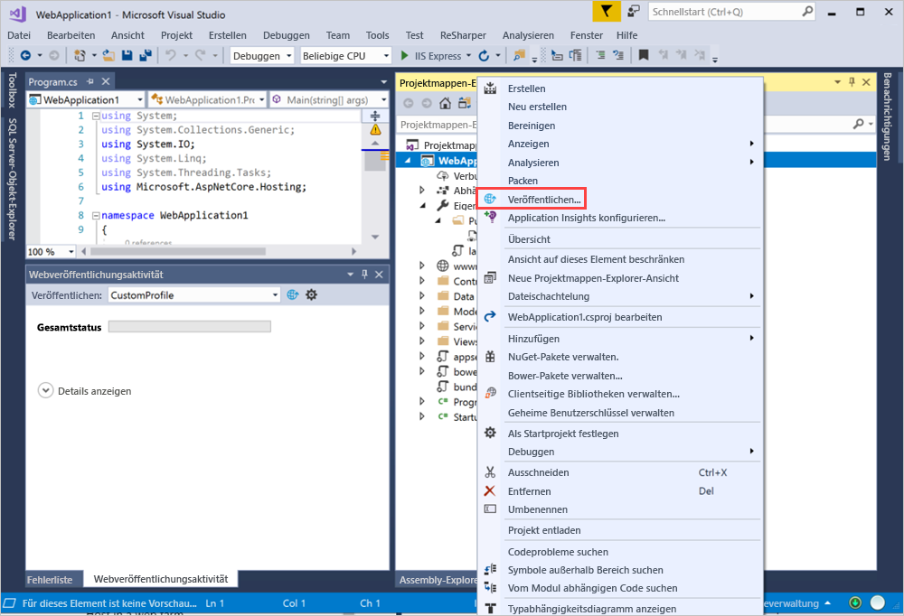
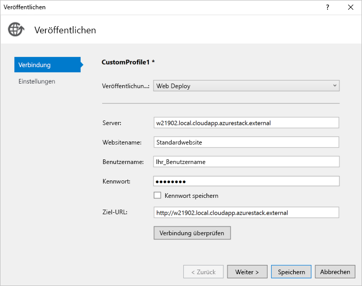

# <a name="deploy-a-c-aspnet-web-app-to-a-vm-in-azure-stack-hub"></a>Bereitstellen einer C#-Web-App (ASP.NET) auf einem virtuellen Computer in Azure Stack Hub

Sie können einen virtuellen Computer erstellen, um Ihre C#-Web-App (ASP.NET) in Azure Stack Hub zu hosten. In diesem Artikel erfahren Sie, wie Sie den Server einrichten, ihn zum Hosten Ihrer C#-Web-App (ASP.NET) konfigurieren und dann die App direkt in Visual Studio bereitstellen.

In diesem Artikel wird eine C# 6.0-App mit ASP.NET Core 2.2 auf einem Windows 2016-Server verwendet.

## <a name="create-a-vm"></a>Erstellen einer VM

1. Erstellen Sie eine [Windows Server-VM](azure-stack-quick-windows-portal.md).

1. Führen Sie das folgende Skript aus, um die IIS (mit Verwaltungskonsole) und die ASP.NET 4.6-Komponenten auf Ihrem virtuellen Computer zu installieren:

    ```PowerShell  
    # Install IIS (with Management Console)
    Install-WindowsFeature -name Web-Server -IncludeManagementTools
    
    # Install ASP.NET 4.6
    Install-WindowsFeature Web-Asp-Net45
    
    # Install Web Management Service
    Install-WindowsFeature -Name Web-Mgmt-Service
    ```

1. Laden Sie [Web Deploy v3.6](https://www.microsoft.com/download/details.aspx?id=43717) herunter. Führen Sie die Installation über die MSI-Datei durch, und aktivieren Sie dann alle Features.

1. Installieren Sie das .NET Core 2.2 Hosting Bundle auf Ihrem Server. Anweisungen dazu finden Sie unter [.NET Core Installer](https://dotnet.microsoft.com/download/dotnet-core/2.2). Stellen Sie sicher, dass Sie auf dem Entwicklungscomputer und dem Zielserver dieselbe Version von .NET Core verwenden.

1. Öffnen Sie im Azure Stack Hub-Portal die Ports, die in den Netzwerkeinstellungen für Ihren virtuellen Computer aufgeführt sind.

    a. Öffnen Sie das Azure Stack Hub-Portal für Ihren Mandanten.

    b. Suchen Sie Ihren virtuellen Computer. Möglicherweise haben Sie den virtuellen Computer an Ihr Dashboard angeheftet. Sie können auch über das Feld **Ressourcen suchen** danach suchen.

    c. Wählen Sie **Netzwerk** aus.

    d. Wählen Sie bei der VM die Option **Regel für eingehenden Port hinzufügen** aus.

    e. Fügen Sie eine Eingangssicherheitsregel für die folgenden Ports hinzu:

    | Port | Protocol | BESCHREIBUNG |
    | --- | --- | --- |
    | 80 | HTTP | Das Hypertext Transfer-Protokoll (HTTP) wird zum Bereitstellen von Webseiten über Server verwendet. Clients stellen eine Verbindung per HTTP über einen DNS-Namen oder eine IP-Adresse her. |
    | 443 | HTTPS | Das Hypertext Transfer-Protokoll Secure (HTTPS) ist eine sichere Version von HTTP, für die ein Sicherheitszertifikat benötigt wird und die die verschlüsselte Übertragung von Informationen ermöglicht.  |
    | 22 | SSH | Secure Shell (SSH) ist ein verschlüsseltes Netzwerkprotokoll für die sichere Kommunikation. Sie verwenden diese Verbindung mit einem SSH-Client, um die VM zu konfigurieren und die App bereitzustellen. |
    | 3389 | RDP | Optional. Das Remotedesktopprotokoll ermöglicht eine Remotedesktopverbindung, um eine grafische Benutzeroberfläche auf Ihrem Computer zu verwenden.   |
    | 8172 | Benutzerdefiniert | Der von WebDeploy verwendete Port. |

    Führen Sie für jeden Port Folgendes aus:

    a. Wählen Sie unter **Quelle** die Option **Alle** aus.

    b. Geben Sie unter **Quellportbereich** ein Sternchen (* *\** _) ein.

    c. Wählen Sie unter „_*Ziel“ die Option **Alle** aus.

    d. Fügen Sie unter **Zielportbereich** den Port hinzu, den Sie öffnen möchten.

    e. Wählen Sie unter **Protokoll** die Option **Alle** aus.

    f. Wählen Sie für **Aktion** die Option **Zulassen** aus.

    g. Übernehmen Sie für **Priorität** den Standardwert.

    h. Geben Sie einen **Namen** und eine **Beschreibung** ein. So können Sie sich erinnern, warum der Port geöffnet ist.

    i. Wählen Sie **Hinzufügen**.

1.  Erstellen Sie in den Einstellungen für **Netzwerk** für Ihre VM in Azure Stack Hub einen DNS-Namen für Ihren Server. Benutzer können über die URL eine Verbindung mit Ihrer Website herstellen.

    a. Öffnen Sie das Azure Stack Hub-Portal für Ihren Mandanten.

    b. Suchen Sie Ihren virtuellen Computer. Möglicherweise haben Sie den virtuellen Computer an Ihr Dashboard angeheftet. Sie können auch über das Feld **Ressourcen suchen** danach suchen.

    c. Wählen Sie **Übersicht**.

    d. Wählen Sie unter **VM** die Option **Konfigurieren** aus.

    e. Wählen Sie für unter **Zuweisung** die Option **Dynamisch** aus.

    f. Geben Sie einen DNS-Namen wie **mywebapp** ein. Ihre vollständige URL lautet dann *mywebapp.local.cloudapp.azurestack.external*.

## <a name="create-an-app"></a>Erstellen einer App 

Sie können eine eigene Web-App oder das Beispiel unter [Veröffentlichen einer ASP.NET Core-App in Azure mit Visual Studio](/aspnet/core/tutorials/razor-pages/razor-pages-start?tabs=visual-studio&view=aspnetcore-2.2) verwenden. Dieser Artikel beschreibt das Erstellen und Veröffentlichen einer ASP.NET-Web-App auf einem virtuellen Azure-Computer mithilfe des Veröffentlichungsfeatures für Azure Virtual Machines in Visual Studio 2017. Nachdem Sie Ihre App installiert und sichergestellt haben, dass sie lokal ausgeführt wird, aktualisieren Sie das Veröffentlichungsziel in den virtuellen Windows-Computer in Ihrer Azure Stack Hub-Instanz.

## <a name="deploy-and-run-the-app"></a>Bereitstellen und Ausführen der App

Erstellen Sie ein Veröffentlichungsziel für Ihre VM in Azure Stack Hub.

1. Klicken Sie im **Projektmappen-Explorer** mit der rechten Maustaste auf Ihr Projekt, und wählen Sie **Veröffentlichen** aus.

    

1. Wählen Sie im Fenster **Veröffentlichen** die Option **Neues Profil** aus.
1. Wählen Sie **IIS, FTP** usw. aus.
1. Wählen Sie **Veröffentlichen**.
1. Wählen Sie als **Veröffentlichungsmethode** die Option **Web Deploy** aus.
1. Geben Sie unter **Server** den zuvor definierten DNS-Namen ein, z. B. *w21902.local.cloudapp.azurestack.external*.
1. Wählen Sie unter **Websitename** die Option **Standardwebsite** aus.
1. Geben Sie unter **Benutzername** den Benutzernamen für den Computer ein.
1. Geben Sie unter **Kennwort** das Kennwort für den Computer ein.
1. Geben Sie unter **Ziel-URL** die URL für den Standort ein, z. B. *mywebapp.local.cloudapp.azurestack.external*.

    

1. Wählen Sie **Verbindung überprüfen** aus, um Ihre Web Deploy-Bereitstellung zu überprüfen, und wählen Sie dann **Weiter**.
1. Legen Sie Ihre **Konfiguration** auf **Release** fest.
1. Legen Sie das **Zielframework** auf  **netcoreapp2.2** fest.
1. Legen Sie die **Zielruntime** als **Portierbar** fest.
1. Wählen Sie **Speichern** aus.
1. Wählen Sie **Veröffentlichen**.
1. Navigieren Sie zu Ihrem neuen Server. Die ausgeführte Webanwendung sollte angezeigt werden.

    ```http  
        mywebapp.local.cloudapp.azurestack.external
    ```

## <a name="next-steps"></a>Nächste Schritte

- Erfahren Sie mehr über das [Einrichten einer Entwicklungsumgebung in Azure Stack Hub](azure-stack-dev-start.md).
- Weitere Informationen zu [häufigen Bereitstellungen für Azure Stack Hub als IaaS](azure-stack-dev-start-deploy-app.md)
- Sehen Sie sich den [Leitfaden für C#](/dotnet/csharp/) an, um die Programmiersprache C# zu erlernen und auf weitere Ressourcen für C# zuzugreifen.
