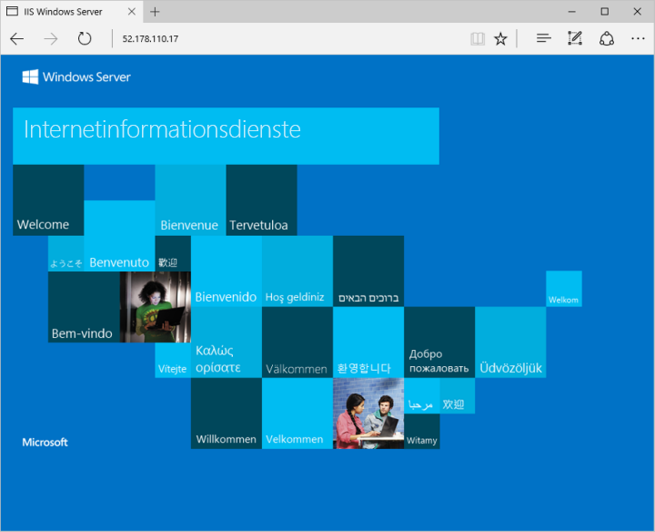

# <a name="quickstart-create-a-windows-server-virtual-machine-using-azure-cli-in-azure-stack-hub"></a>Schnellstart: Erstellen eines virtuellen Windows Server-Computers mithilfe der Azure CLI in Azure Stack Hub

Sie können einen virtuellen Windows Server 2016-Computer mithilfe der Azure CLI erstellen. Befolgen Sie die Schritte in diesem Artikel zum Erstellen und Verwenden eines virtuellen Computers. In diesem Artikel führen Sie auch die folgenden Schritte aus:

* Herstellen der Verbindung mit dem virtuellen Computer über einen Remoteclient
* Installieren des IIS-Webservers und Anzeigen der Standardstartseite
* Bereinigen Ihrer Ressourcen

## <a name="prerequisites"></a>Voraussetzungen

* Stellen Sie sicher, dass Ihr Azure Stack Hub-Betreiber das Image **Windows Server 2016** dem Azure Stack Hub-Marketplace hinzugefügt hat.

* Azure Stack Hub erfordert eine spezifische Version der Azure CLI, um die Ressourcen zu erstellen und zu verwalten. Wenn Sie die Azure CLI nicht für Azure Stack Hub konfiguriert haben, führen Sie die Schritte zum [Installieren und Konfigurieren der Azure CLI](azure-stack-version-profiles-azurecli2.md) aus.

## <a name="create-a-resource-group"></a>Erstellen einer Ressourcengruppe

Eine Ressourcengruppe ist ein logischer Container, in dem Sie Azure Stack Hub-Ressourcen bereitstellen und verwalten können. Führen Sie in Ihrer Azure Stack Hub-Umgebung den Befehl [az group create](/cli/azure/group#az-group-create) aus, um eine Ressourcengruppe zu erstellen.

> [!NOTE]
>  Allen Variablen in den Codebeispielen sind Werte zugewiesen. Sie können bei Bedarf aber auch neue Werte zuweisen.

Im folgenden Beispiel wird eine Ressourcengruppe mit dem Namen myResourceGroup am lokalen Speicherort erstellt:

```cli
az group create --name myResourceGroup --location local
```

## <a name="create-a-virtual-machine"></a>Erstellen eines virtuellen Computers

Erstellen Sie einen virtuellen Computer (VM) mit dem Befehl [az vm create](/cli/azure/vm#az-vm-create). Im folgenden Beispiel wird ein virtueller Computer namens „myVM“ erstellt. In diesem Beispiel wird „Demouser“ als Benutzername und Demouser@123 als Kennwort für den Administrator verwendet. Ändern Sie diese Werte in für Ihre Umgebung geeignete Werte.

```cli
az vm create \
  --resource-group "myResourceGroup" \
  --name "myVM" \
  --image "Win2016Datacenter" \
  --admin-username "Demouser" \
  --admin-password "Demouser@123" \
  --location local
```

Nachdem die VM erstellt wurde, enthält der Parameter **PublicIPAddress** in der Ausgabe die öffentliche IP-Adresse für den virtuellen Computer. Notieren Sie sich diese Adresse, da Sie sie für die Nutzung des virtuellen Computers benötigen.

## <a name="open-port-80-for-web-traffic"></a>Öffnen von Port 80 für Webdatenverkehr

Da diese VM als IIS-Webserver fungieren soll, muss Port 80 für Datenverkehr mit dem Internet geöffnet werden.

Verwenden Sie zum Öffnen von Port 80 den Befehl [az vm open-port](/cli/azure/vm):

```cli
az vm open-port --port 80 --resource-group myResourceGroup --name myVM
```

## <a name="connect-to-the-virtual-machine"></a>Verbinden mit dem virtuellen Computer

Erstellen Sie mit dem nächsten Befehl eine Remotedesktopverbindung mit Ihrem virtuellen Computer. Ersetzen Sie „Öffentliche IP-Adresse“ durch die IP-Adresse Ihres virtuellen Computers. Geben Sie bei entsprechender Aufforderung den Benutzernamen und das Kennwort für den virtuellen Computer ein.

```
mstsc /v <Public IP Address>
```

## <a name="install-iis-using-powershell"></a>Installieren von IIS mithilfe von PowerShell

Nachdem Sie sich am virtuellen Computer angemeldet haben, können Sie IIS mithilfe von PowerShell installieren. Starten Sie PowerShell auf dem virtuellen Computer, und führen Sie den folgenden Befehl aus:

```powershell
Install-WindowsFeature -name Web-Server -IncludeManagementTools
```

## <a name="view-the-iis-welcome-page"></a>Anzeigen der IIS-Willkommensseite

Die Standardwillkommensseite von IIS kann in einem beliebigen Browser angezeigt werden. Verwenden Sie die öffentliche IP-Adresse, die im vorherigen Abschnitt angegeben ist, um die Standardseite zu besuchen:



## <a name="clean-up-resources"></a>Bereinigen von Ressourcen

Bereinigen Sie die Ressourcen, die Sie nicht mehr benötigen. Führen Sie den Befehl [az group delete](/cli/azure/group#az-group-delete) aus, um die Ressourcengruppe, den virtuellen Computer und alle dazugehörigen Ressourcen zu entfernen.

```cli
az group delete --name myResourceGroup
```

## <a name="next-steps"></a>Nächste Schritte

In diesem Schnellstart haben Sie einen einfachen virtuellen Windows Server-Computer bereitgestellt. Um weitere Informationen zu virtuellen Computern unter Azure Stack Hub zu erhalten, fahren Sie mit [Überlegungen zu virtuellen Computern in Azure Stack Hub](azure-stack-vm-considerations.md) fort.
