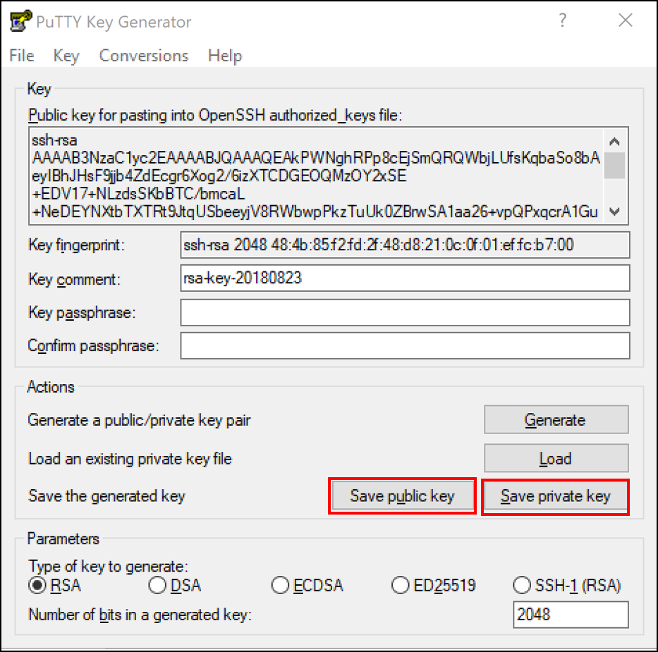
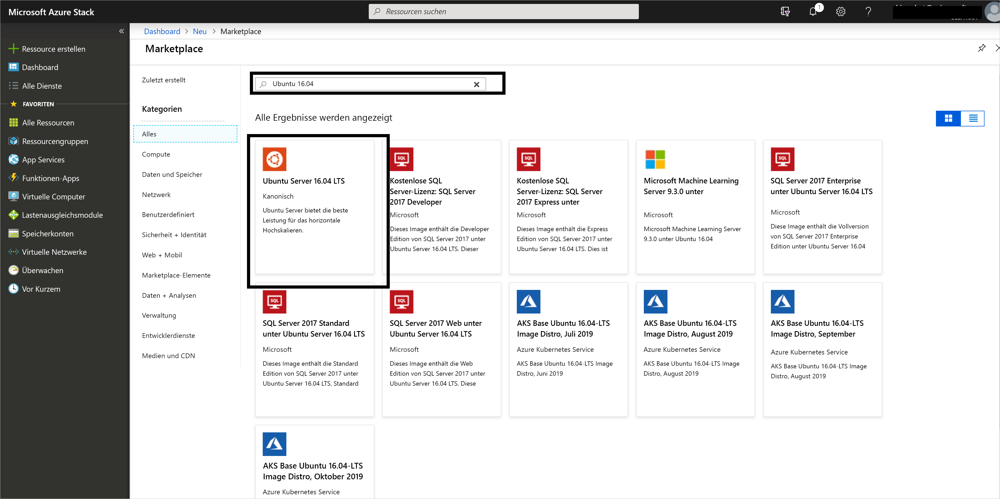
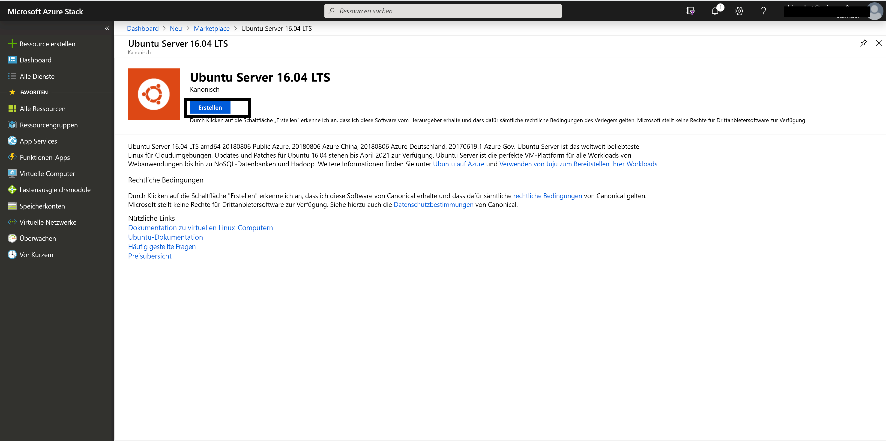
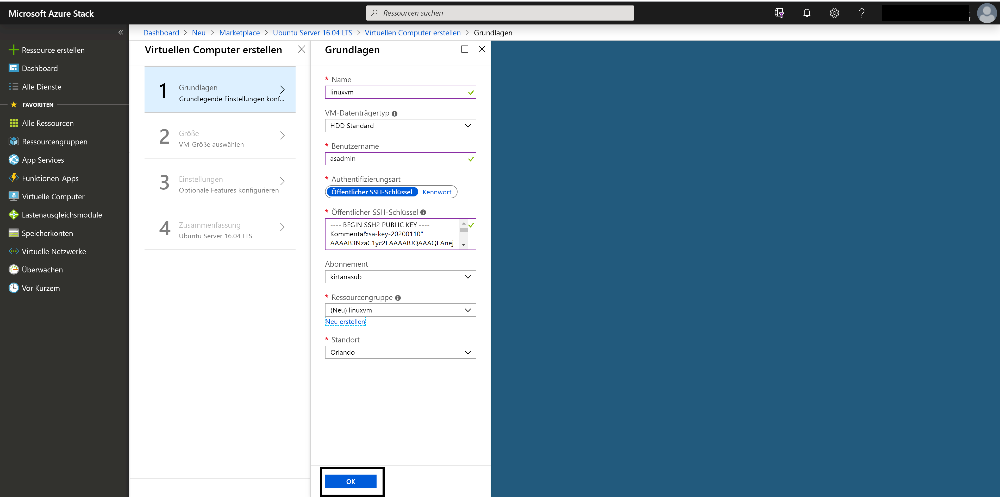
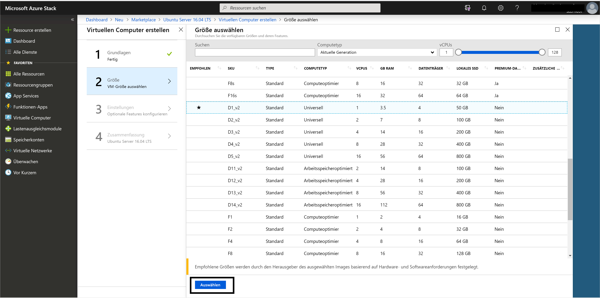
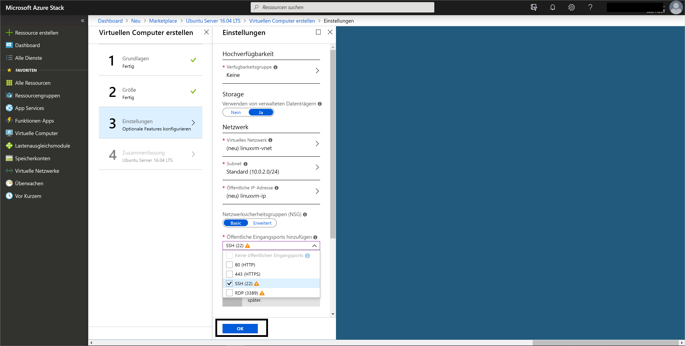
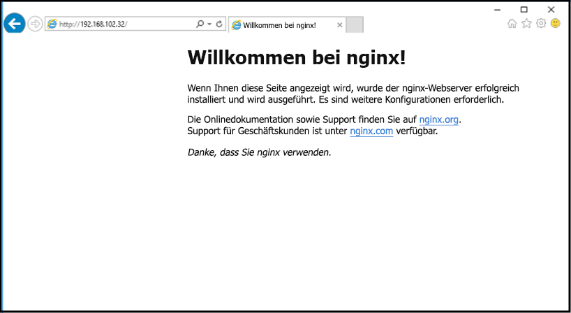

# <a name="quickstart-create-a-linux-server-vm-by-using-the-azure-stack-hub-portal"></a>Schnellstart: Erstellen eines virtuellen Linux-Server mit dem Azure Stack Hub-Portal

Sie können einen virtuellen Computer (VM) mit Ubuntu Server 16.04 LTS über das Azure Stack Hub-Portal erstellen. In diesem Artikel erstellen und verwenden Sie einen virtuellen Computer. In diesem Artikel erhalten Sie außerdem Informationen zu den folgenden Schritten:

* Herstellen der Verbindung mit dem virtuellen Computer über einen Remoteclient
* Installieren eines NGINX-Webservers
* Bereinigen Ihrer Ressourcen

> [!NOTE]  
> Die Abbildungen in diesem Artikel wurden aktualisiert, um die Änderungen anzuzeigen, die in Version 1808 von Azure Stack Hub eingeführt wurden. Version 1808 bietet Unterstützung für die Verwendung von *verwalteten Datenträgern* zusätzlich zu nicht verwalteten Datenträgern. Bei Verwendung einer älteren Version weichen die Abbildungen für einige Aufgaben (etwa die Datenträgerauswahl) von der Anzeige auf Ihrer Benutzeroberfläche ab.  

## <a name="prerequisites"></a>Voraussetzungen

* Ein Linux-Image im Azure Stack Hub-Marketplace

   Im Azure Stack Hub-Marketplace ist nicht standardmäßig ein Linux-Image enthalten. Bitten Sie den Azure Stack Hub-Betreiber, das benötigte Image „Ubuntu Server 16.04 LTS“ bereitzustellen. Hierzu kann der Betreiber die Anweisungen unter [Herunterladen von Marketplace-Elementen in Azure Stack Hub](../operator/azure-stack-download-azure-marketplace-item.md) befolgen.

* Zugriff auf einen SSH-Client

   Wenn Sie das Azure Stack Development Kit (ASDK) verwenden, haben Sie unter Umständen keinen Zugriff auf einen SSH-Client (Secure Shell). Falls Sie einen Client benötigen, stehen mehrere Pakete zur Verfügung, die einen SSH-Client enthalten. So enthält beispielsweise PuTTY einen SSH-Client und einen SSH-Schlüsselgenerator (puttygen.exe). Weitere Informationen zu den verfügbaren Paketen finden Sie unter [Verwenden eines öffentlichen SSH-Schlüssels](azure-stack-dev-start-howto-ssh-public-key.md).

* In dieser Schnellstartanleitung wird PuTTY verwendet, um die SSH-Schlüssel zu generieren und eine Verbindung mit dem virtuellen Linux-Server herzustellen. [Laden Sie PuTTY herunter, und installieren Sie es.](https://www.putty.org)

## <a name="create-an-ssh-key-pair"></a>Erstellen eines SSH-Schlüsselpaars

Für die Schritte in diesem Artikel benötigen Sie ein SSH-Schlüsselpaar. Falls Sie bereits über ein SSH-Schlüsselpaar verfügen, können Sie diesen Schritt überspringen.

So erstellen Sie ein SSH-Schlüsselpaar:

1. Navigieren Sie zum PuTTY-Installationsordner (der Standardspeicherort ist *C:\Program Files\PuTTY*), und führen Sie Folgendes aus:

    `puttygen.exe`

1. Legen Sie im Fenster **PuTTY Key Generator** die Option **Type of key to generate** (Typ des zu generierenden Schlüssels) auf **RSA** und **Number of bits in a generated key** (Anzahl von Bits in einem generierten Schlüssel) auf **2048** fest.

   

1. Wählen Sie **Generieren** aus.

1. Bewegen Sie den Zeiger innerhalb des Felds **Key** (Schlüssel), um einen Schlüssel zu generieren.

1. Wählen Sie nach Abschluss der Schlüsselgenerierung **Save public key** (Öffentlichen Schlüssel speichern) und anschließend **Save private key** (Privaten Schlüssel speichern) aus, um Ihre Schlüssel in Dateien zu speichern.

   

## <a name="sign-in-to-the-azure-stack-hub-portal"></a>Anmelden beim Azure Stack Hub-Portal

Die Adresse des Azure Stack Hub-Portals hängt davon ab, mit welchem Azure Stack Hub-Produkt Sie eine Verbindung herstellen:

* Navigieren Sie für das ASDK zu https://portal.local.azurestack.external.

* Rufen Sie bei einem integrierten Azure Stack Hub-System die vom Azure Stack Hub-Betreiber bereitgestellte URL auf.

## <a name="create-the-vm"></a>Erstellen des virtuellen Computers

1. Wählen Sie **Ressource erstellen** > **Compute** aus. Suchen Sie nach `Ubuntu Server 16.04 LTS`. Wählen Sie den Namen aus.

   

1. Klicken Sie auf **Erstellen**.

   

1. Geben Sie die Informationen des virtuellen Computers ein. Wählen Sie unter „Authentifizierungstyp“ die Option **Öffentlicher SSH-Schlüssel** aus, fügen Sie den von Ihnen gespeicherten öffentlichen SSH-Schlüssel ein, und wählen Sie dann **OK** aus.

    > [!Note]  
    > Entfernen Sie alle voran- und nachgestellten Leerzeichen des Schlüssels.

   

1. Wählen Sie **D1_v2** als Größe für den virtuellen Computer aus.

   

1. Ändern Sie die Standardwerte auf dem Blatt **Einstellungen**. Aktivieren Sie „Verwaltete Datenträger verwenden“. Falls Sie SSH-Zugriff zulassen müssen, wählen Sie **SSH (22)** aus, um den Port zu öffnen. Wenn Ihre Konfigurationen abgeschlossen sind, wählen Sie **OK** aus.

   

1. Wählen Sie in der Zusammenfassung **OK** aus, um die Bereitstellung des virtuellen Computers zu starten. Wählen Sie zum Anzeigen des neuen virtuellen Computers **Virtuelle Computer** aus, suchen Sie nach dessen Namen, und wählen Sie ihn dann aus den Suchergebnissen aus.


## <a name="connect-to-the-vm"></a>Herstellen der Verbindung zur VM

1. Wählen Sie auf der VM-Seite **Verbinden** aus. Sie können die SSH-Verbindungszeichenfolge ermitteln, die für die Verbindungsherstellung mit der VM benötigt wird. 

1. Scrollen Sie auf der Seite **PuTTY Configuration** (PuTTY-Konfiguration) im Bereich **Category** (Kategorie) nach unten, erweitern Sie **SSH**, und wählen Sie dann **Auth** (Authentifizierung) aus. 

   

1. Wählen Sie **Browse** (Durchsuchen) und dann die Privatschlüsseldatei aus, die Sie gespeichert haben.

1. Scrollen Sie im Bereich **Category** (Kategorie) nach oben, und wählen Sie **Session** (Sitzung) aus.

1. Fügen Sie im Feld **Host Name (or IP address)** (Hostname (oder IP-Adresse)) die Verbindungszeichenfolge aus dem Azure Stack Hub-Portal ein. In diesem Beispiel ist dies *asadmin@192.168.102.34* .

1. Wählen Sie **Open** (Öffnen) aus, um eine Sitzung für den virtuellen Computer zu öffnen.

   

## <a name="install-the-nginx-web-server"></a>Installieren des NGINX-Webservers

Geben Sie die folgenden Bash-Befehle ein, um Paketquellen zu aktualisieren und das neueste NGINX-Paket auf dem virtuellen Computer zu installieren.

```bash
#!/bin/bash

# update package source
sudo apt-get -y update

# install NGINX
sudo apt-get -y install nginx
```

Beenden Sie die SSH-Sitzung nach Abschluss der NGINX-Installation, und öffnen Sie im Azure Stack Hub-Portal die Seite **Übersicht** des virtuellen Computers.

## <a name="open-port-80-for-web-traffic"></a>Öffnen von Port 80 für Webdatenverkehr

Mit einer Netzwerksicherheitsgruppe (NSG) wird eingehender und ausgehender Datenverkehr geschützt. Bei der Erstellung einer VM im Azure Stack Hub-Portal wird für SSH-Verbindungen an Port 22 eine Eingangsregel für Datenverkehr erstellt. Da diese VM einen Webserver hostet, muss eine NSG-Regel erstellt werden, die Webdatenverkehr an Port 80 zulässt.

1. Wählen Sie auf der Seite **Übersicht** des virtuellen Computers den Namen der **Ressourcengruppe** aus.

1. Wählen Sie die **Netzwerksicherheitsgruppe** für die VM aus. Sie können die NSG anhand der Spalte **Typ** ermitteln.

1. Wählen Sie im linken Bereich unter **Einstellungen** die Option **Eingangssicherheitsregeln** aus.

1. Wählen Sie **Hinzufügen**.

1. Geben Sie im Feld **Name** die Zeichenfolge **http** ein. 

1. Stellen Sie sicher, dass **Portbereich** auf 80 und **Aktion** auf **Zulassen** festgelegt ist.

1. Klicken Sie auf **OK**.

## <a name="view-the-welcome-to-nginx-page"></a>Anzeigen der Willkommensseite von nginx

Nachdem NGINX installiert und Port 80 auf dem virtuellen Computer geöffnet wurde, können Sie über die öffentliche IP-Adresse des virtuellen Computers auf den Webserver zugreifen. (Die öffentliche IP-Adresse wird auf der Seite **Übersicht** des virtuellen Computers angezeigt.)

Öffnen Sie einen Webbrowser, und navigieren Sie zu *http://\<öffentliche IP-Adresse>* .



## <a name="clean-up-resources"></a>Bereinigen von Ressourcen

Bereinigen Sie die Ressourcen, die Sie nicht mehr benötigen. Wählen Sie zum Löschen des virtuellen Computers und seiner Ressourcen auf der VM-Seite die Ressourcengruppe und dann **Löschen** aus.

## <a name="next-steps"></a>Nächste Schritte

In dieser Schnellstartanleitung haben Sie einen einfachen virtuellen Linux-Server mit einem Webserver bereitgestellt. Weitere Informationen zu Azure Stack Hub-VMs finden Sie unter [Features von Azure Stack Hub-VMs](azure-stack-vm-considerations.md).
