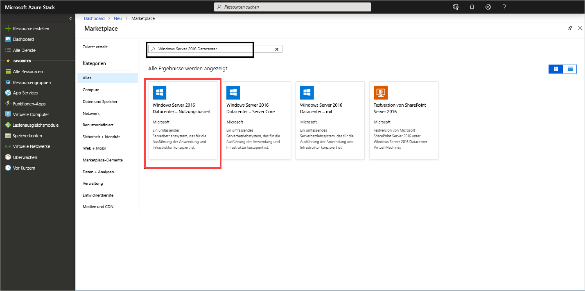
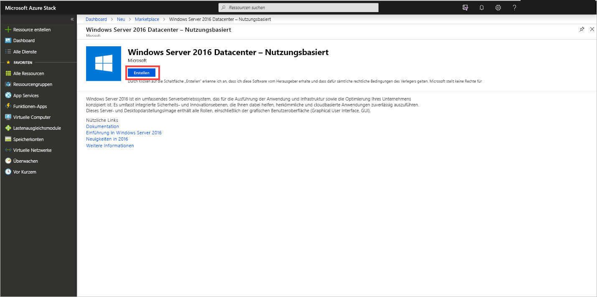
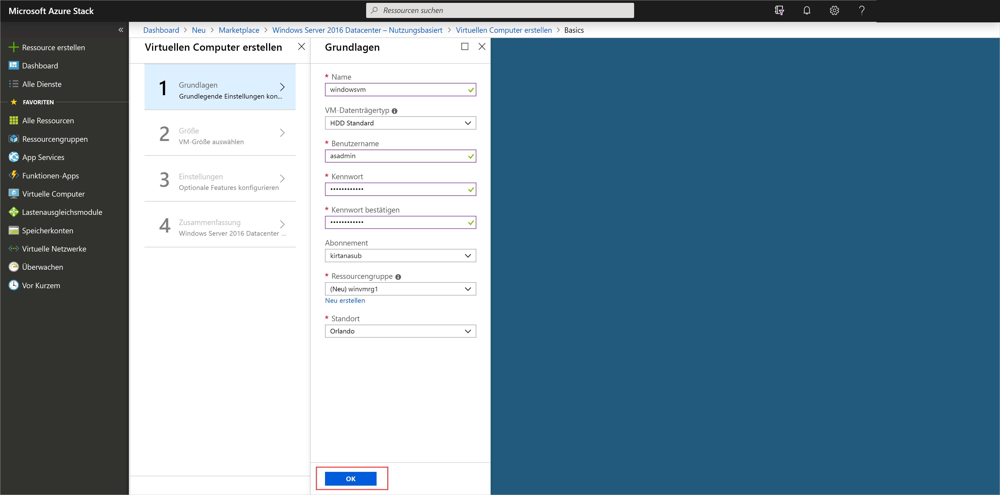
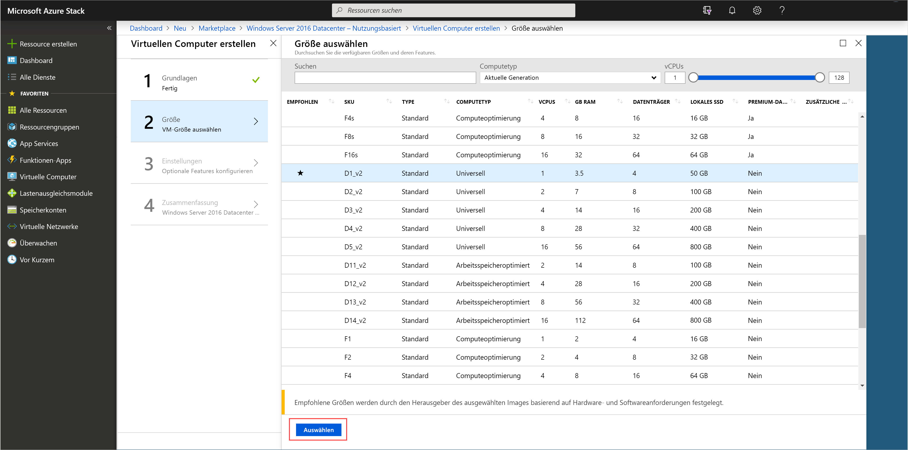
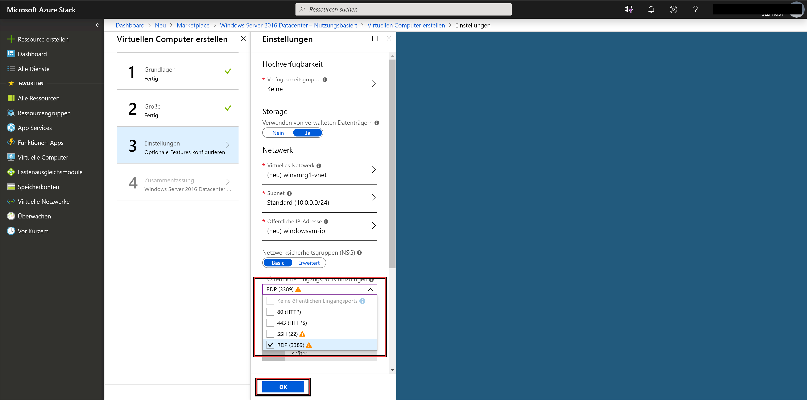
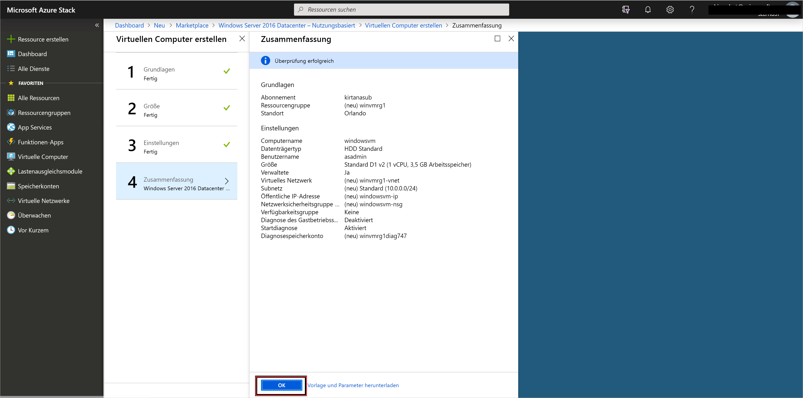
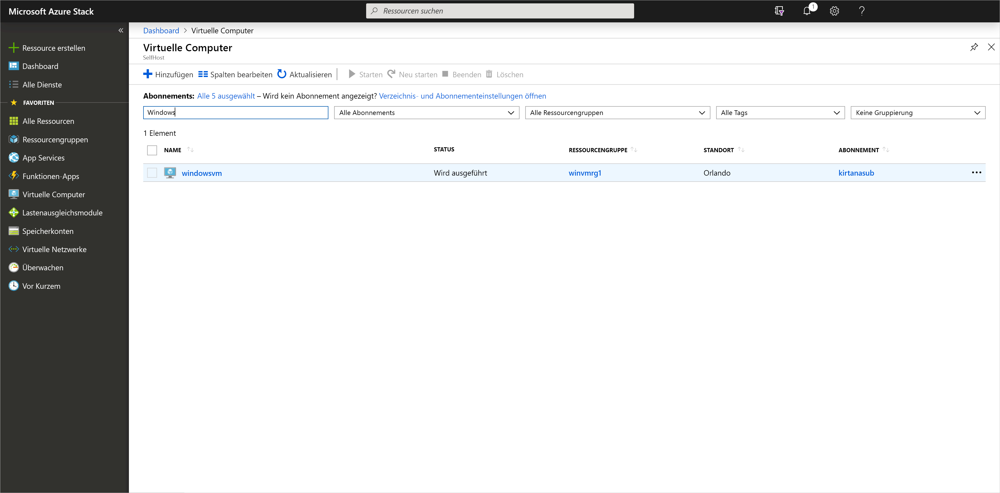

# Schnellstart: Erstellen eines virtuellen Windows Server-Computers mit dem Azure Stack Hub-Portal

Hier erfahren Sie, wie Sie einen virtuellen Windows Server 2016-Computer (VM) mit dem Azure Stack Hub-Portal erstellen.

> [!NOTE]  
> Die Screenshots in diesem Artikel werden entsprechend der Benutzeroberfläche aktualisiert, die mit der Azure Stack Hub-Version 1808 eingeführt wurde. 1808 bietet Unterstützung für die Verwendung von *verwalteten Datenträgern*, zusätzlich zu nicht verwalteten Datenträgern. Wenn Sie eine frühere Version verwenden, unterscheiden sich einige Abbildungen, wie die Datenträgerauswahl, von denen, die in diesem Artikel gezeigt werden.  

## Anmelden beim Azure Stack Hub-Portal

Melden Sie sich beim Azure Stack Hub-Portal an. Die Adresse des Azure Stack Hub-Portals hängt davon ab, mit welchem Azure Stack Hub-Produkt Sie eine Verbindung herstellen:

* Verwenden Sie für das Azure Stack Development Kit (ASDK) die folgende Adresse: `https://portal.local.azurestack.external`.
* Rufen Sie bei einem integrierten Azure Stack Hub-System die vom Azure Stack Hub-Betreiber bereitgestellte URL auf.

## Erstellen einer VM

1. Wählen Sie **Ressource erstellen** > **Compute** aus. Suchen Sie nach ` Windows Server 2016 Datacenter - Pay as you use`.
    Wird der Eintrag **Windows Server 2016 Datacenter – nutzungsbasierte Bezahlung** nicht angezeigt, wenden Sie sich an Ihren Azure Stack Hub-Cloudbetreiber, und bitten Sie ihn, das Image zum Azure Stack Hub-Marketplace hinzuzufügen. Eine entsprechende Anleitung findet Ihr Cloudbetreiber unter [Erstellen und Veröffentlichen eines benutzerdefinierten Azure Stack Hub-Marketplace-Elements](../operator/azure-stack-create-and-publish-marketplace-item.md).

    

1. Klicken Sie auf **Erstellen**.

    

1. Geben Sie unter **Grundlagen** Werte für **Name**, **Datenträgertyp**, **Benutzername** und **Kennwort** ein. Wählen Sie ein **Abonnement**aus. Erstellen Sie eine **Ressourcengruppe**, oder wählen Sie eine vorhandene aus, und wählen Sie einen **Speicherort** und anschließend **OK** aus.

    

1. Wählen Sie **D1_v2** unter **Größe** und dann **Auswählen** aus.

    

1. Nehmen Sie auf der Seite **Einstellungen** sämtliche gewünschten Änderungen an den Standardwerten vor. Sie müssen die gewünschten öffentlichen Eingangsports über das zugehörige Dropdownmenü konfigurieren. Wählen Sie **OK**, wenn Sie fertig sind.

    

1. Wählen Sie zum Erstellen des virtuellen Computers unter **Zusammenfassung** die Option **OK** aus.

    

1. Wählen Sie zum Überprüfen des neuen virtuellen Computers **Virtuelle Computer** aus. Suchen Sie nach dem Namen des virtuellen Computers, und wählen Sie ihn dann in den Suchergebnissen aus.

## Bereinigen von Ressourcen

Wenn Sie den virtuellen Computer nicht mehr benötigen, können Sie ihn und die Ressourcen löschen. Wählen Sie hierzu die Ressourcengruppe auf der Seite des virtuellen Computers und dann **Löschen** aus.

## Nächste Schritte

In dieser Schnellstartanleitung haben Sie einen einfachen virtuellen Windows Server-Computer bereitgestellt. Weitere Informationen zu Azure Stack Hub-VMs finden Sie unter [Features von Azure Stack Hub-VMs](azure-stack-vm-considerations.md).
