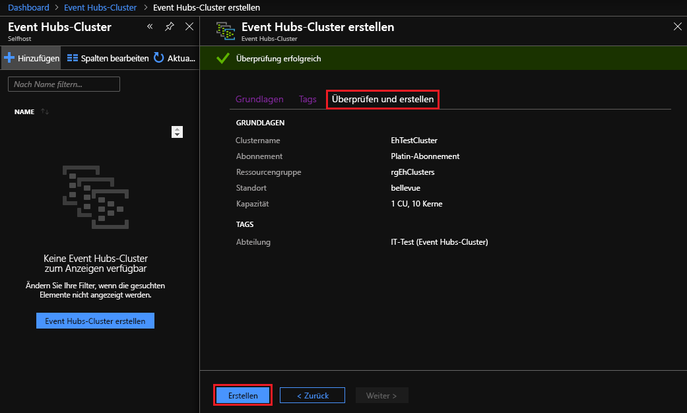

# Schnellstart: Erstellen eines Event Hubs-Clusters über das Azure Stack Hub-Portal

[!INCLUDE [preview-banner](../includes/event-hubs-preview.md)]

In dieser Schnellstartanleitung erfahren Sie, wie Sie über das Azure Stack Hub-Benutzerportal einen Event Hubs-Cluster erstellen. 

Event Hubs-Cluster ermöglichen Bereitstellungen mit einem einzelnen Mandanten für besonders hohe Streaminganforderungen. Ein Event Hubs-Cluster kann Millionen von Ereignissen pro Sekunde mit garantierter Kapazität und Wartezeiten im Sekundenbruchteilbereich erfassen. Event Hubs-Cluster verfügen über alle gängigen Features und erreichen nahezu Featureparität mit der Azure Event Hubs-Edition.

## Voraussetzungen

Vergewissern Sie sich zunächst, dass der Event Hubs-Dienst in Ihrem Abonnement verfügbar ist, bevor Sie mit dieser Schnellstartanleitung beginnen. Falls nicht, [installieren Sie den Ressourcenanbieter „Event Hubs on Azure Stack Hub“ (Event Hubs in Azure Stack Hub)](../operator/event-hubs-rp-overview.md) in Zusammenarbeit mit Ihrem Administrator. In den Installationsschritten wird auch die Erstellung eines Angebots beschrieben, das den Event Hubs-Dienst enthält. 

Sobald ein Angebot verfügbar ist, kann der Administrator Ihr Abonnement mit Event Hubs erstellen oder aktualisieren. Alternativ können Sie [das neue Angebot abonnieren und Ihr eigenes Abonnement erstellen](azure-stack-subscribe-services.md).

## Übersicht

Zur Erstellung von Event Hubs-Clustern werden Kapazitätseinheiten (Capacity Units, CUs) angegeben. Eine Kapazitätseinheit ist eine vorab zugeordnete Menge an CPU-, Speicher- und Arbeitsspeicherressourcen. Event Hubs-Cluster werden nach CPU/Stunde abgerechnet. Die Anzahl der von einem Cluster verwendeten Kerne (CPUs) wird im Rahmen der Clustererstellung beim Auswählen der Anzahl von Kapazitätseinheiten (Clustergröße) angezeigt. Ausführlichere Informationen zur Clusterressourcenverwendung finden Sie unter [Kapazitätsplanung für Event Hubs in Azure Stack Hub](../operator/event-hubs-rp-capacity-planning.md). 

In dieser Schnellstartanleitung erfahren Sie, wie Sie das Azure Stack Hub-Benutzerportal für Folgendes verwenden:
- Erstellen eines Event Hubs-Clusters mit einer einzelnen Kapazitätseinheit
- Erstellen eines Namespace im Cluster
- Erstellen Sie eines Event Hubs im Namespace
- Löschen eines Event Hubs-Clusters

## Erstellen eines Event Hubs-Clusters

Ein Event Hubs-Cluster bietet einen Container mit einem eindeutigen Bereich, in dem Sie einen oder mehrere Namespaces erstellen können. Führen Sie die folgenden Schritte aus, um einen Event Hubs-Cluster zu erstellen: 

1. Melden Sie sich beim Azure Stack Hub-Benutzerportal an.
2. Wählen Sie im linken Navigationsbereich die Option  **Alle Dienste** aus, geben Sie „Event Hubs-Cluster“ in die Suchleiste ein, und wählen Sie in der Ergebnisliste das Element **Event Hubs-Cluster** aus.
3. Wählen Sie auf der Seite **Event Hubs-Cluster** im oberen Menü die Option **+ Hinzufügen** aus. Daraufhin wird auf der rechten Seite der Bereich **Event Hubs-Cluster erstellen** geöffnet.
4. Gehen Sie auf der Registerkarte **Grundeinstellungen** der Seite **Event Hubs-Cluster erstellen** wie folgt vor:  
   - **Clustername**: Geben Sie einen Namen ein. Das System überprüft sofort, ob dieser Name verfügbar ist. Falls ja, wird auf der rechten Seite des Felds ein Häkchen angezeigt. 
   - **Abonnement**: Wählen Sie das Abonnement aus, in dem Sie den Cluster erstellen möchten. 
   - **Ressourcengruppe**: Erstellen Sie die Ressourcengruppe, in der Sie den Cluster erstellen möchten, bzw. wählen Sie sie aus. 
   - Wählen Sie die Schaltfläche **Weiter: Tags >**  am unteren Seitenrand aus, um den Vorgang fortzusetzen. Unter Umständen dauert es etwas, bis das System die Ressourcen vollständig bereitgestellt hat. 

   

5. Gehen Sie auf der Registerkarte **Tags** wie folgt vor: 
   - Geben Sie optional die Name-Wert-Paare für die Ressourcentags ein.  
   - Wählen Sie die Schaltfläche **Weiter: Überprüfen + erstellen >**  aus, um den Vorgang fortzusetzen. 

   

6. Auf der Registerkarte **Überprüfen + erstellen** sollte am oberen Rand der Seite auch ein Banner mit dem Hinweis „Überprüfung erfolgreich“ angezeigt werden. Wählen Sie die Option **Erstellen** aus, wenn Sie die Angaben überprüft haben und zum Erstellen des Clusters bereit sind. 

   

   >[!NOTE]
   > Eine Event Hubs-Clusterbereitstellung dauert in der Regel mindestens 45 Minuten.

7. Während der Bereitstellung wird eine Seite mit dem Status **Ihre Bereitstellung wird ausgeführt.** angezeigt. Nach Abschluss der Bereitstellung wird auf der Seite der Status **Ihre Bereitstellung wurde abgeschlossen.** angezeigt. Wählen Sie die Schaltfläche **Zu Ressource wechseln** aus, um den neuen Cluster anzuzeigen, bevor Sie mit dem nächsten Abschnitt fortfahren.

   

## Erstellen eines Namespace

Erstellen Sie als Nächstes einen Namespace in Ihrem neuen Cluster:

1. Wählen Sie auf der Seite **Übersicht** von **Event Hubs-Cluster** im oberen Menü die Option **+ Namespace** aus. 

   

2. Gehen Sie im Bereich **Namespace in Cluster erstellen** wie folgt vor:

   - **Name**: Geben Sie einen Namen für den Namespace ein. Das System überprüft sofort, ob dieser Name verfügbar ist. Falls ja, wird auf der rechten Seite des Felds ein Häkchen angezeigt. 
   - **Liste mit Eigenschaften/Werten**: Der Namespace erbt die folgenden Eigenschaften: 
     - Abonnement-ID 
     - Resource group 
     - Standort 
     - Clustername 

   - Wählen Sie  **Erstellen** aus, um den Namespace zu erstellen:

   

3. Der neue Namespace wird unter **Clusternamespaces** angezeigt. Wählen Sie den Link für Ihren neuen Namespace aus, bevor Sie mit dem nächsten Abschnitt fortfahren. 

   

## Erstellen eines Ereignis-Hubs

1. Wählen Sie auf der Seite **Übersicht** von **Event Hubs-Namespace** im oberen Menü die Option **+ Event Hub** aus.  

   

2. Gehen Sie im Bereich **Event Hub erstellen** wie folgt vor:
   - **Name**: Geben Sie einen Namen für den Event Hub ein. Der Name darf nur Buchstaben, Ziffern, Punkte, Bindestriche und Unterstriche enthalten. Der Name muss mit einem Buchstaben oder einer Ziffer beginnen und enden. Das System überprüft sofort, ob dieser Name verfügbar ist. Falls ja, wird auf der rechten Seite des Felds ein Häkchen angezeigt.
   - Wählen Sie  **Erstellen** aus, um den Event Hub zu erstellen.

   

## Löschen eines Event Hubs-Clusters

So löschen Sie den Cluster:

1. Wählen Sie im linken Navigationsbereich erneut **Alle Dienste** aus. Geben Sie „Event Hubs-Cluster“ in die Suchleiste ein, und wählen Sie in der Ergebnisliste das Element **Event Hubs-Cluster** aus.
2. Navigieren Sie auf der Seite **Event Hubs-Cluster** zu dem Cluster, den Sie zuvor erstellt haben, und wählen Sie ihn aus.

   

3. Gehen Sie auf der Seite **Übersicht** von **Event Hubs-Cluster** wie folgt vor:
   - Wählen Sie im oberen Menü die Option **Löschen** aus.  
   - Daraufhin wird auf der rechten Seite der Bereich **Cluster löschen** mit einer Löschbestätigungsmeldung geöffnet. 
   - Geben Sie den Namen des Clusters ein, und wählen Sie **Löschen** aus, um den Cluster zu löschen. 

   

## Nächste Schritte

In dieser Schnellstartanleitung haben Sie gelernt, wie Sie einen Event Hubs-Cluster über das Portal erstellen. Fahren Sie nun mit der ersten Schnellstartanleitung zum Senden und Empfangen von Ereignissen fort:  

> [!div class="nextstepaction"]
> [Senden oder Empfangen von Ereignissen an und von Azure Event Hubs: .NET Core (Azure.Messaging.EventHubs)](/azure/event-hubs/get-started-dotnet-standard-send-v2)
